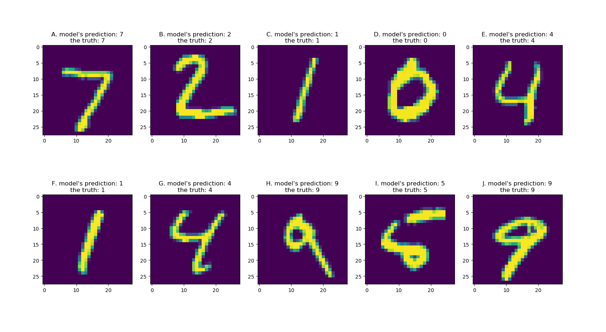

> All of this material is also available on [Google Docs](https://docs.google.com/document/d/1BF6gwBQreKTAfhidf_J_N_Iv1MyDmQPUa-0_3f3W_7k/edit?tab=t.mcr5a041tko3) (*MSU login required*)

## This Week's Case

*Source: https://github.com/JoshEvan/Handwritten-Digits-Recognition-Using-Neural-Network-With-Tensorflow-and-Keras*

**Two systems that look at pixels and decide what they are: the U.S. Postal Service reading handwritten ZIP codes, and police departments running facial recognition.**

These are close cousins. Both take an image, break it into a grid of numbers, and pass those numbers through layers of simple units until a label comes out the other end. The math is nearly the same. The neural network that reads your grandparents's handwriting on an envelope is a direct ancestor of the one that scans a security camera still.

What differs is what happens when they're wrong.

When the mail system fails, an envelope goes to a room in Salt Lake City where a person looks at a photo of it and types the address. The letter might arrive late, but it gets there eventually. When facial recognition fails, [Robert Williams gets arrested on his front lawn in Farmington Hills](https://www.nytimes.com/2020/06/24/technology/facial-recognition-arrest.html) in front of his wife and two daughters for a theft he had nothing to do with.

This week we focus on **Tools**. The lesson is not that neural networks are good or bad. It's that every tool has a *failure profile*. There is a rate of failure, a pattern of who it fails, and a cost borne by someone. Two systems can share an architecture and have completely different failure profiles.

## Prep reading & resources (Complete by Wed, Sep 9)

*You do not individually have to review all materials. We expect that you will spend at least 90 minutes with these materials. Groups can discuss how to ensure all posted materials are reviewed each week.*

### How the tool works

* 📺 [But what is a neural network?](https://www.youtube.com/watch?v=aircAruvnKk) (3Blue1Brown via YouTube, Chapter 1) — the single most important tool in AI and machine learning. Grant Sanderson builds a network that reads handwritten digits off a 28×28 grid of pixels, which is exactly what we will do by hand in class. Watch for the idea that each neuron holds a number between 0 and 1, and that a "feature" like a loop or an edge is just a pattern of these numbers (called "weights") (19 min).
* 📺 [Gradient descent, how neural networks learn](https://www.youtube.com/watch?v=IHZwWFHWa-w) (3Blue1Brown via YouTube, Chapter 2) — where the numbers come from. Nobody hand-writes the weights; the network adjusts them by measuring how wrong it is and taking a small step downhill, millions of times. Don't panic at the notation. If you follow the idea of a cost that gets minimized by many tiny corrections, you have what you need (21 min).

### Reading the mail

* 📖 [Postal Service tests handwriting recognition system](https://www.govexec.com/federal-news/1999/02/postal-service-tests-handwriting-recognition-system/1746/) (Government Executive, 1999) — this is the historical baseline. When it launched, the handwriting system was right **30 to 40% of the time** and that was considered a triumph. *Why* is recognizing handwriting hard? It is not sloppiness. People write all over the envelope and machines struggled to segment the address into parts.
* 📺 [How the US Postal Service reads terrible handwriting](https://www.youtube.com/watch?v=XxCha4Kez9c) (Tom Scott, 2022) — Scott visits the Remote Encoding Center in Salt Lake City, the last one in the country, and sits down at a keyer's station to try the job himself. This facility handles roughly 1.2 billion mail images a year — about 38 every second — and it exists *only* to process the envelopes the machines gave up on (7 min).
* 📖 [Systems at Work](https://postalmuseum.si.edu/exhibition/systems-at-work/the-exhibition) (Smithsonian National Postal Museum) — the step-by-step of what happens to a letter. The Advanced Facer-Canceller photographs envelopes as they fly past, then software finds the stamp, locates the address block, reads the handwriting, and checks it against a database of known addresses. Note that last step: the system isn't recognizing letters in a vacuum, it's matching against a list of addresses that actually exist. That constraint is doing enormous work. There is also video called 📺 [All Systems at Work](https://www.youtube.com/watch?v=ELAHw0JNdVk) embedded in this site (9 min).

### Reading faces

* 📖 [Gender Shades: Project Overview](https://www.media.mit.edu/projects/gender-shades/overview/) (Buolamwini & Gebru, MIT Media Lab) — Joy Buolamwini started this after running her own conference headshot through commercial face software. The core finding: existing benchmark datasets were **79.6% and 86.2% lighter-skinned**, so companies were measuring accuracy against a population that wasn't the world. Her phrase for it is "pale male data." There is a video called 📺 [Gender Shades](https://www.youtube.com/watch?v=TWWsW1w-BVo) (5 min) as well as a 🎧 [Ted Radio Interview with Joy Buolamwini](https://www.npr.org/2018/01/26/580619086/joy-buolamwini-how-does-facial-recognition-software-see-skin-color) (9 min) embedded in this site.
* 📖 [Study finds gender and skin-type bias in commercial AI systems](https://news.mit.edu/2018/study-finds-gender-skin-type-bias-artificial-intelligence-systems-0212) (MIT News, 2018) — the numbers behind the project. Error rates for lighter-skinned men never exceeded **0.8%**. For darker-skinned women they ran to **34.7%**, and for the darkest-skinned women in the set, **46.5% and 46.8%**. As Buolamwini puts it, the system might as well have been guessing. Also note the company that advertised 97% accuracy on a test set that was 77% male and 83% white.
* 📖 [Facial Recognition](https://www.aclumich.org/cases/facial-recognition/) (ACLU of Michigan) — this one happened here. In 2020 Detroit [police arrested Robert Williams](https://www.nytimes.com/2020/06/24/technology/facial-recognition-arrest.html) on his front lawn based almost entirely on a facial recognition scan of Shinola store footage. There is a 📺 [short video documentary](https://www.youtube.com/watch?v=Tfgi9A9PfLU) (8 min) embedded in this site. He wasn't the man in the video and wasn't near the store. There are 📖 [three known wrongful arrests](https://www.wired.com/story/wrongful-arrests-ai-derailed-3-mens-lives/) from Detroit police facial recognition; all three people were Black. One, 📖 [Porcha Woodruff](https://apnews.com/article/detroit-police-facial-recognition-lawsuit-cab0ae44c1671fc30617d301b21b2d13), was eight months pregnant when six officers came to her home.
* 📖 [Civil Rights Advocates Achieve the Nation's Strongest Police Department Policy on Facial Recognition](https://www.aclumich.org/press-releases/civil-rights-advocates-achieve-nations-strongest-police-department-policy-facial/) (ACLU of Michigan, June 2024) — what changed. Detroit police can no longer arrest someone on facial recognition results alone, or run a photo lineup straight off a facial recognition search, and every case since 2017 where the technology produced an arrest warrant gets reviewed. Law students at U-M worked this case for four years. Policy is a thing people build, slowly.

**The complication**

* 📖 [Actionable Auditing](https://www.media.mit.edu/publications/actionable-auditing-investigating-the-impact-of-publicly-naming-biased-performance-results-of-commercial-ai-products/) (Raji & Buolamwini, 2019) — read this before you conclude the story is simple. After Gender Shades was published, the named companies went back and fixed their systems, and the error gaps for darker-skinned women narrowed substantially. Public auditing worked. So: is the problem the tool, the training data, the absence of testing, or the absence of anyone required to test? Your group has to take a position.

*Optional and longer: the documentary* [Coded Bias](https://www.pbs.org/independentlens/documentaries/coded-bias/) *(2020) follows Buolamwini's work and is often available online.*

## Wednesday: We Build a Network Out of People

You are the network. We will not use computers.

### Round 1 — one layer, in your groups (~15 min)

Each group gets a printed digit rendered on a coarse grid. Each person (except one) in the group owns one or more cells and can report exactly one thing about their cell: filled or empty. You are the **input neurons**. One group member, who acts as the **output neuron**, turns away and cannot see the grid.

The rule that makes this work: input neurons may not say "it looks like a seven." You report your cell. That's all you have. The output neuron announces the digit.

Run it twice with different digits. You all can discuss how your input neurons can change what they describe in either a given cell or assigning a set of cells. **Notice how much better the output neuron gets the second time.** That improvement is training.

### Round 2 — join another group to add a hidden layer (~15 min)

Now we chain. Input neurons still report only their own cells, but they report to a **middle layer**, and each middle-layer student is assigned one question: *is there a horizontal bar across the top? a vertical stroke down the right? a closed loop?* Middle-layer students poll only the cells they need and pass forward a single number from 0 to 3 for how confident they are to the output neuron. The middle layer can't see the digits and the output neuron hears only the middle layer never the raw cells.

**How did the task change?** Easier? Harder? More "compute"?

### Round 3 — the questions we can't write (~15 min)

Back in your groups. No image this time, and nothing to run.

In Round 2, we told the middle layer what to ask: *horizontal bar across the top? closed loop?* Those questions were easy for us to write because we already know what digits are made of: ten symbols, drawn with a few strokes, and everyone agrees on what they look like.

Now do the same job for faces. Your grid shows a person. Your task is to **write the questions**, under the same rules as Round 2:

* A first-layer neuron sees only its own cells and reports filled/empty.
* A middle-layer neuron may poll only a specific list of cells and must return a single number, 0 to 3.
* No neuron at any layer may name a person.

**Write five questions for your first middle layer. Then write three questions for a second middle layer that only hears the first.** 

Some things you will probably run into:

* **The question is really the answer.** "Is this Denzel Washington's jawline?" isn't a feature.
* **The question needs an answer you don't have yet.** "Are the eyes far apart?" is a good question, but it assumes something already found the eyes. Which layer did that, and what did *it* ask?
* **The question only works once.** A question tuned to one person's specific face tells you nothing about the next one.
* **The feature isn't in the grid.** Some of what distinguishes two faces is simply gone at this resolution.

The point isn't that these are unanswerable. Real systems answer them, with far more layers and far more resolution than we have. The point is **we can't write them down, and neither can the engineers.** For digits, a person can specify the features. For faces, nobody specifies the. The network finds something during training, and what it finds is not written in any language a person can read.

So: we know these systems work often enough to be deployed. We cannot often say what they are looking at.

**The question that carries into Friday:** when the mail system misreads an envelope, the letter comes back, the customer calls, or the encoding center logs it. And the whole apparatus is *built* around expecting that: a confidence threshold, a fallback path, the lovely people in Salt Lake City catching what falls below the line.

When a face system misidentifies someone, what tells you? Who finds out, and how long does it take? Robert Williams found out when police arrived at his house. Gender Shades exists because, until someone went looking, *nobody had checked*.

## Focus for Week 2

This week we add **Tools** to the Case Study. You will still complete the Data section — we're building up, not moving on — but your evaluation this week focuses on the Tools parts. Data should now come more easily, and you can be briefer there than you were in Week 1.

### What "meeting the standard" looks like this week

Your Tools section has four prompts. **Analyze facial recognition as the tool.** The postal system is your comparison case and you'll need it for the fourth prompt, and you may use it anywhere else it helps.

The habit from Week 1 carries over unchanged: a specific claim with a source, not a general statement. For Tools, "specific" means naming a mechanism, a number, or a rule, that is, something that could be checked.

**1. Mechanism — what does the tool actually do?**

Describe the path from input to output in terms a classmate could follow. An image comes in; what is it turned into? What comes out the other end (a name, a ranked list, a score)? Your group should be able to say where the numbers in the middle came from.

* Weak: *"The AI scans the face and identifies the person."*

**2. Provenance — who built it, on what, and who decided it was good enough?**

Name the builder where you can. More importantly, name what it was trained and *tested* on, and who set the bar for release. This is where Week 1 comes back: the benchmark is itself a dataset someone assembled.

* Weak: *"It was trained on biased data."*

**3. Deployment — what is the output allowed to do?**

This is the prompt most groups will underweight and it's the one that matters most. A tool doesn't act. A system around it acts. What happens to the output when it leaves the model? Who receives it, what are they permitted to do with it, and what is the procedure when the system isn't confident?

* Weak: *"Police use facial recognition to find suspects."*

**4. Failure profile — rate, pattern, cost, and who absorbs it.**

Four things, all four required. How often is it wrong? Is it wrong evenly, or does the error concentrate on particular people? What does a single error cost? And who pays that cost — the operator, the institution, or the person in the image?

Then the comparison: **do the same four for the postal system, in two or three sentences, and explain why two systems built on the same idea produce such different profiles.**

* Weak: *"Facial recognition has a high error rate for people of color, which is unfair."*

### The trap to avoid

**Do not treat "the technology is flawed" as your answer.** The USPS handwriting reader launched at 30–40% accuracy, which is far worse than any facial recognition system discussed here, and the harm was a late envelope. What did it take to make a 30% system safe? A confidence threshold, a fallback path, and a staffed room in Salt Lake City catching everything below the line. Detroit had none of that.

Accuracy alone tells you almost nothing. What matters is what a system is permitted to *do* with an answer it isn't sure about, and who bears the cost when it's wrong. Detroit's settlement didn't improve the algorithm at all. It changed what police were allowed to do with the output.

*If your Tools section would still be correct with the accuracy numbers deleted, you've analyzed the system. If deleting them empties the section, you've only analyzed the model.*

### Working through the materials

Same as last week: divide the materials among yourselves and bring back what you found. Four threads again —

1. How the tool actually works (3Blue1Brown, both chapters)
2. A system that works well enough, and what "well enough" required (USPS)
3. How the failures were discovered (Gender Shades)
4. What the failures cost and what changed afterward (Detroit)

Thread 1 is the one nobody should skip entirely. If no one in your group watched Chapter 1, your Tools section will describe a black box rather than a mechanism.

Where your group disagrees, write the disagreement down. The Actionable Auditing reading is designed to produce disagreement.

## Citations

Cite all sources in **APA format** in the Research Resources section. Every factual claim in your Data and Tools sections should be traceable to something on that list.

## Turning In

When you have completed your Case Study, download the Word or PDF version of your tab and turn it in on D2L to the assignment **Week 2 Case Study**. It is a group assignment, so only one member of the group needs to turn it in.

Each of you also submits an **Individual Effort & Metacognitive Report** (~250 words) as a separate individual upload on D2L. Describe what you contributed, what you learned, and any AI used in your work.

**Week 2's Case Study and Individual Reports are due by Sunday, September 13th at 11:59pm.**

## Reminders

Put your group's names at the top of the page, and do not copy from or to other groups' Case Studies.

Case Studies that do not meet the standard will be returned without credit, and your group will have one week from receiving it to revise and meet the standard.

---