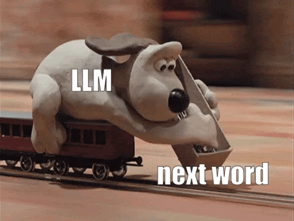

> All of this material is also available on [Google Docs](https://docs.google.com/document/d/1B8PK5DYWUfF0pedki7fMniqInfBWnvmHz0OH041urzQ/edit?tab=t.0) (*MSU login required*)

*Source: <https://sreeragpanat.substack.com/p/why-every-product-manager-should>*

## Predicting the Next Word

In June 2017, eight researchers at Google published an eleven-page paper called "[Attention Is All You Need](https://proceedings.neurips.cc/paper_files/paper/2017/hash/3f5ee243547dee91fbd053c1c4a845aa-Abstract.html)." It described a way for a computer to process an entire sequence of text at once — a sentence, a paragraph, a whole article — instead of walking through it word by word. They called the architecture a **transformer**. Five years later, in November 2022, that architecture reached the public as [ChatGPT](https://en.wikipedia.org/wiki/ChatGPT).

The thing it does is narrower than it looks. Given some text, it produces a **probability distribution over what comes next**, then picks from that distribution, then does it again. That's it. The essay it produced, the code you asked for, the email you edited, and the fabricated citations are that loop running over and over.

This week we add **Practices** from the DTPA framework. Data and tools are only part of the story. People form the other parts of it: who built it, on whose words, with whose labor, using whose water and electricity, and who is now expected to use it, at what pace, with what checking step quietly removed. Practices asks who is doing this, who is paying for it, and who has influenced our use, misuse, and choices to not use these technologies.

## Prep reading & resources (Complete by Mon, Sep 14)

*You do not individually have to review all materials. We expect that you will spend at least 90 minutes with these materials. Groups can discuss how to ensure all posted materials are reviewed each week.*

### How the tool works

* 📖 [Generative AI exists because of the transformer](https://ig.ft.com/generative-ai/) (Murgia and the Visual Storytelling Team, *Financial Times*, 2023). Transformers process an entire sequence at once, analyzing all its parts rather than individual words, which is the change that made everything after 2017 possible. This webpage also covers where these systems go wrong. **If you read one thing this week, please read this.**
* 📺 [But what is a GPT?](https://www.youtube.com/watch?v=wjZofJX0v4M) (3Blue1Brown via YouTube, Chapter 5) — predict, sample, repeat. Pay attention to the section on **softmax with temperature**, because that is precisely what we will be doing with dice on Monday (27 min).
* 📺 [Attention in transformers, visually explained](https://www.youtube.com/watch?v=eMlx5fFNoYc) (3Blue1Brown via YouTube, Chapter 6) — how context gets computed. The example to remember from this video: the word "mole" in "American shrew mole," "one mole of carbon dioxide," and "a biopsy of the mole." This same word has at least three meanings, and the model has to work out which from everything around it. (26 min).
* 🖱️ [Transformer Explainer](https://poloclub.github.io/transformer-explainer/) (Cho et al., Georgia Tech) — a real GPT-2 running in your browser. Type a sentence and watch the probability distribution over the next word change as you edit. There is a also temperature slider; play with it before class on Monday and the dice game we are planning will make sense as an even simpler version of this.

### Where the words came from

* 📖 [How ChatGPT and our foundation models are developed](https://help.openai.com/en/articles/7842364-how-chatgpt-and-our-foundation-models-are-developed) (OpenAI) - help page from OpenAI that describes how the company has built it's foundation models. Remember that this is a public description from a company (and corporate leaders) that has a vested interest in protecting it's practices as well as staying out of legal trouble. **This is an important read.**
* 📺 [We Tracked a Shipment of Rare Books. It Ended at an Amazon AI Training Facility](https://www.youtube.com/watch?v=_sf2VoKvxBk) (Maiberg, *404 Media*) — reporters hid a tracking device inside a rare book they suspected would be bought for AI training data, then followed it across the country to an Amazon warehouse in Las Vegas. Employees there say the job is receiving pallets of printed books and cutting the bindings off so they can be scanned faster. Amazon's book-buying operation had never been reported before. Note the method: this is what it took to find out, and a four-person outlet had to do it. (52 min). **This is an important watch to contrast with OpenAI's self report.**
* 📖🔒 [The Unbelievable Scale of AI's Pirated Book Problem](https://www.theatlantic.com/technology/archive/2025/03/libgen-meta-openai/682093/) (Reisner, *The Atlantic*, 2025; **needs MSU login - go to sign-in and select Institution**) — includes a search tool covering the 7.5 million books in LibGen. Search an author you love.
* 🖱️ [Anthropic Copyright Settlement Works List](https://secure.anthropiccopyrightsettlement.com/lookup) — the searchable list of roughly 500,000 books covered by a $1.5 billion settlement. Two things happened in that case and courts treated them oppositely: buying physical books, cutting the bindings, scanning them and destroying the originals was ruled fair use as a format conversion, while downloading millions of books from pirate libraries was not. 
* 📖🔒  [Common Crawl investigation](https://www.theatlantic.com/technology/archive/2025/11/common-crawl-ai-training-data/684567/) (Reisner, *The Atlantic*, 2025, **needs MSU login - go to sign-in and select Institution**) — the nonprofit whose web scrape underpins much of this told publishers it respected paywalls and honored removal requests. Reporting found otherwise.

### Who did the labor

**Note:** This reporting can be quite challenging to watch, listen to, or read. I urge that you consider your mental health when reviewing some of these links. The reality is that the these generative AI systems have been built off a worldwide exploitation of labor. 

Take care, please.

* 📖 [Data workers detail exploitation by tech industry](https://techcrunch.com/2024/07/08/data-workers-detail-exploitation-by-tech-industry-in-dair-report) (*TechCrunch*, 2024) — short framing piece. Note the structural point: workers sit as subcontractors to subcontractors, so lines of responsibility blur if anything ever goes wrong. *This is the most benign of readings in this section.*
* 📖 [OpenAI Used Kenyan Workers on Less Than $2 Per Hour](https://time.com/6247678/openai-chatgpt-kenya-workers/) (Perrigo, *TIME*, 2023) — to build a filter that could catch descriptions of sexual abuse, torture, and self-harm, someone first had to read tens of thousands of such passages and label them. Workers took home between roughly $1.32 and $2 an hour. OpenAI was billed about $12.50 an hour for that same labor. *Content warning: the article describes the material workers had to read and view that you might find disturbing.*
* 🎧 [Don’t Fall for the AI Hype](https://techwontsave.us/episode/151_dont_fall_for_the_ai_hype_w_timnit_gebru.html) (Paris Marx, 2023) - this is an audio version of the same story about Kenyan Workers with an interview with Timnit Gebru. *Content warning: the podcast describes the material workers had to read and view that you might find disturbing.*

### What it costs, and who lives next to it

* 📖 [Environmental cost of AI's energy use](https://unu.edu/inweh/news/environmental-cost-of-AIs-Enrgy-use-carbon-water-and-land-footprints) (United Nations University, 2026) — global data centers used an estimated 448 TWh of electricity in 2025; as a country that would rank 11th, behind France and ahead of Saudi Arabia. The correction most people need: **inference, not training, is the majority of it.** Training GPT-3 took roughly 1.3 GWh, once. Serving billions of daily queries accounts for an estimated 80 to 90 percent of a deployed model's energy. This is not a thing that was done. It is a thing being done, continuously, including by us.
* 🎧 [What AI data centers are doing to your electric bill](https://www.npr.org/2025/12/19/nx-s1-5649814/ai-data-center-electricity-bill) (Planet Money, Dec 2025) — traces a single Ohio electric bill back to its source (32 min).
* 🎧 [No AI data centers in my backyard!](https://www.npr.org/transcripts/nx-s1-5581445) (The Indicator from Planet Money, 2025) — Pavilion Township, outside Kalamazoo, fighting a proposed data center. One resident: it brings no tourism, no jobs, nothing, only issues. Roughly 10 minutes, full transcript posted (10 min).
* 🎧 [Data Vampires](https://techwontsave.us/episode/241_data_vampires_going_hyperscale_episode_1) (Paris Marx, *Tech Won't Save Us*, first episode of a four-part series) — the most sustained critical treatment of data centers available in audio. Episode 1 covers the push to hyperscale (31 min).

### The practices being built right now

* 📖 [AI chatbots could be making you stupider](https://www.bbc.com/future/article/20260417-ai-chatbots-could-be-making-you-stupider) (Hogenboom, *BBC*, 2026) - public reporting on research performed on "Cognitive Offloading." Based on a study of students writing essays using LLMs, Search Engines, and "Brain-only" from MIT's Media Lab.
* 📖 [Your Brain on ChatGPT: Accumulation of Cognitive Debt when Using an AI Assistant for Essay Writing Task](https://arxiv.org/abs/2506.08872) (Kosmyna et al., *ArXiV*, 2025) - the original paper that the BBC report is based on. **Long paper** focus on the Introduction and the Discussion.
* 📖 [AI Is Supercharging the War on Libraries, Education, and Human Knowledge](https://www.404media.co/ai-is-supercharging-the-war-on-libraries-education-and-human-knowledge/) (Koebler, *404 Media*, 2025) — a school library catalog product added an AI "sensitive material marker" with traffic-light risk ratings, advertising that districts may cut manual review workload by more than 80 percent when complying with book-ban legislation. Librarians describe being flooded with AI-generated books they must screen while being handed AI tools to screen them. A complete Practices case in one article.

## Activity: Building a Story Word by Word

In your groups, start with the word "Once" and for 2 minutes rotate adding a word to build a story. Does it make sense? Are there multiple sentences?

Again, in your groups, start with the phrase "We took the dog for a walk and…" For 2 more minutes rotate adding a word to build a story. Does it make sense? Are there multiple sentences?

### Discussion Questions

1. What differences did you notice about the story you built from a single word compared to a phrase?
2. How does this story-building exercise connect to Generative AI like ChatGPT?

## Activity: How do LLMs work anyhow? - Rolling a Sentence with One Die

*Designed by Vashti Sawtelle and Danny Caballero with the help of [MadLibs](https://en.wikipedia.org/wiki/Mad_Libs) (TM)*

### Instructions:

You have each been given dice to roll. For the narratives below, EACH of you will roll dice individually and compare the resulting narratives that you produced (highlight or mark each time you roll). There are reflection questions to answer as a group. We will share out together after groups have had a chance to work through Narrative 1 and Narrative 2, and, then, after Narrative 3.

### Narrative 1

Once upon a time, there lived a **\[word 1\]** in a **\[word 2\]** town who was known to be exceptionally **\[word 3\]**. One morning they found **\[word 4\]** box on their front doorstep. A note attached to the top of the box contained a **\[word 5\]** message. Knowing what they had to do they prepared for a **\[word 6\]** journey.

#### Equal Probabilities

| **Dice Roll** | **Word 1** | **Word 2** | **Word 3** | **Word 4** | **Word 5** | **Word 6** |
| --- | --- | --- | --- | --- | --- | --- |
| 1 | boy | tiny | generous | heavy | cryptic | perilous |
| 2 | girl | forgotten | cunning | black | threatening | thrilling |
| 3 | queen | hidden | brave | dusty | urgent | tedious |
| 4 | prince | magical | impulsive | polished | exciting | solitary |
| 5 | witch | prosperous | stubborn | wooden | demanding | long |
| 6 | wizard | gloomy | unlucky | crystal | unexpected | unexpected |

#### Weighted Probabilities

| **Dice Roll** | **Word 1** | **Word 2** | **Word 3** | **Word 4** | **Word 5** | **Word 6** |
| --- | --- | --- | --- | --- | --- | --- |
| 1 | boy | forgotten | brave | polished | cryptic | perilous |
| 2, 3 | queen | hidden | generous | dusty | threatening | thrilling |
| 4, 5, 6 | witch | gloomy | cunning | wooden | unexpected | long |

### Narrative 2

The professor **\[word 1\]** across the room and handed me an envelope. "I've reviewed your project," she said, her voice sounding surprisingly **\[word 2\]**. The letter inside was incredibly **\[word 3\]**. Leaving the classroom, I felt a deep sense of **\[word 4\]** about the **\[word 5\]** work ahead.

#### Equal Probabilities

| **Dice Roll** | **Word 1** | **Word 2** | **Word 3** | **Word 4** | **Word 5** |
| --- | --- | --- | --- | --- | --- |
| 1 | marched | gentle | detailed | worry | unpredictable |
| 2 | strolled | exhausted | encouraging | relief | exhausting |
| 3 | danced | hesitant | brief | disappointment | annoying |
| 4 | rushed | enthusiastic | formal | dread | easy |
| 5 | strode | excited | blunt | determination | exciting |
| 6 | plodded | stern | confusing | gratitude | challenging |

#### Weighted Probabilities

| **Dice Roll** | **Word 1** | **Word 2** | **Word 3** | **Word 4** | **Word 5** |
| --- | --- | --- | --- | --- | --- |
| 1 | marched | exhausted | detailed | worry | exhausting |
| 2, 3, 4 | strode | stern | brief | dread | annoying |
| 5, 6 | rushed | excited | encouraging | determination | challenging |

### Narrative 1 and 2 Reflection Questions

1. Which narratives seemed more coherent or consistent? Was this true across your individual rolls?
2. Which narratives seemed less understandable or inconsistent? Was this true across your individual rolls?
3. What is the difference you notice between the context of Narrative 1 and Narrative 2 in terms of their consistency or coherence? Was one narrative more likely to be coherent?
4. What is the difference you notice between equal and weighted rolls? Was one more likely to be coherent?

## Activity: How do LLMs work anyhow? - Rolling a Sentence with Two Dice

### Sum of Two Dice

Each of you roll two dice and add them together. Unlike Narratives 1 and 2, you won't find an "equal probability" version of this table. Some sums are simply more common than others, no weighting is required. Write the narrative that your rolls produce.

### Narrative 3

The forecaster stood before the map and declared that today would be **[word 1]**. The chance of rain, she explained, was **[word 2]**. Looking out the window, everything outside appeared **[word 3]**. The crowd's mood shifted to **[word 4]** as they braced for what was shaping up to be a **[word 5]** afternoon.

| **Sum** | **Ways to roll it** | **Word 1** | **Word 2** | **Word 3** | **Word 4** | **Word 5** |
| --- | --- | --- | --- | --- | --- | --- |
| 2 | 1/36 | apocalyptic | certain | terrifying | panic | disastrous |
| 3 | 2/36 | catastrophic | highly likely | ominous | dread | dreadful |
| 4 | 3/36 | severe | probable | gray | worry | difficult |
| 5 | 4/36 | unsettled | possible | hazy | unease | uneventful |
| 6 | 5/36 | cloudy | uncertain | overcast | indifference | routine |
| 7 | 6/36 | mild | fifty-fifty | ordinary | calm | ordinary |
| 8 | 5/36 | pleasant | unlikely | bright | relief | pleasant |
| 9 | 4/36 | sunny | doubtful | clear | cheer | enjoyable |
| 10 | 3/36 | gorgeous | improbable | radiant | joy | wonderful |
| 11 | 2/36 | perfect | remote | dazzling | excitement | magical |
| 12 | 1/36 | miraculous | impossible | otherworldly | euphoria | legendary |

#### Reflection Questions for Narrative 3

1. Roll the dice **20 times individually** and record each sum. Count each roll in the table above.
2. Compare your 20 rolls with your group mates. Are your distributions identical? Should they be?
3. Add all your counts together and sketch the distribution of your group's rolls.
4. How is this different from the "weighted" tables in Narratives 1 and 2? There, *we* decided which word was more likely. Here, who or what decided it?
5. What might happen to the narrative if the number of dice was increased to 1,000? Or 10,000? In keeping with this model, we'd have to increase the number of selected words to match. Notice which words would fall near the middle of any distribution compared to those near the ends (e.g., for two dice: 6, 7, 8 vs. 2 and 12).

### One thing this activity gets wrong on purpose

Dice tables are a lookup. A transformer is not. The rolling shows you what the model does *with* the probabilities, which is the last step of a long process. The transformer is how those probabilities get computed in the first place, using everything in the context at once. That is what Chapter 5 and the FT explainer cover, and it is the piece the dice cannot show you.

## Activity: Simulations — Watermarking AI-Produced Text

Our prior activities produced toy models of LLMs to build a conceptual understanding of how this might work. But the details of transformers and LLMs are more complicated than simply rolling dice — the text is random, but *contextually* random. We can start to understand this by looking at how Anthropic is changing its approach to generating text in response to new EU regulations.

The [European Union has passed a regulation](https://digital-strategy.ec.europa.eu/en/policies/code-practice-ai-generated-content) that requires the products of generative AI to be detectable as such.

Anthropic has decided to develop a [watermarking technique](https://www.anthropic.com/news/claude-text-watermark) that biases the selection of the next word using the prior context (i.e., what was written before).

For this activity, go to [declaude.org/watermarking](https://declaude.org/watermarking/) and work through the simulations. The site illustrates how LLMs actually work, compared to the toy models we built in the previous activities.

#### Reflection Questions for Watermarking

1. How does an LLM typically produce the next word in a sentence?
2. How is Claude changing that with a "secret key"? What is it changing about the selection of the next word?
3. How does this secret key approach allow generated text to be detected?
4. What does this biasing of text generation using a secret key say about how these GenAI companies think about the task of writing?

## Wednesday and Friday: Find a Case and Start your Analysis

**Research a specific use of Generative AI in some industry**

You choose your own. It must be documented and specific enough to name who used the tool and when. "AI in healthcare" is not a case. "A hospital system that deployed an AI scribe to draft clinical notes" is.

Places to start looking:

| Where | What you'll find |
|---|---|
| [AI Hallucination Cases Database](https://www.damiencharlotin.com/hallucinations/) | 2,000+ court decisions, filterable to Michigan |
| [AI Incident Database](https://incidentdatabase.ai/) | Structured, cross-domain, sourced |
| [404 Media](https://www.404media.co/tag/ai-slop/) | Ongoing reporting on AI in workplaces, schools, libraries |
| [The Data Workers' Inquiry](https://data-workers.org/) | Worker-authored accounts of building these systems; *Content warning: The material here can be quite disturbing.* |
| [Atlantic LibGen search](https://www.theatlantic.com/technology/archive/2025/03/libgen-meta-openai/682093/) / [Settlement Works List](https://secure.anthropiccopyrightsettlement.com/lookup) | Search for a specific book |

**You are not required to pick something harmful.** You are required to pick something **documented**, and then to follow the labor and the resources wherever they actually go.

## Focus for Week 3

This week we focus on **Practices** and **Quantitative Literacy**. You will still consider Data and Tools as we are building up, not moving on, but your evaluation this week focuses on the Practices parts. Data and Tools should be getting faster; you can be brief because you might want these notes for the future.

### What "meeting the standard" looks like this week

The habit carries over unchanged: a specific claim with a source, not a general statement. For Practices, "specific" means naming **people, workflows, and decisions**; this is not the same as capabilities of the technology.

* **Use — how does the tool actually get used?** Describe the workflow, not the product. Who sits down and prompts it? Who receives the output? What did that person do before this tool existed, and what are they expected to do instead now? Where in the chain is someone supposed to check the result, and is that step written down anywhere or merely assumed?
    * Weak: *"Schools are using AI to review books."*
* **Labor and resources — what did it take to build, and what does it take to run?** Both halves are required. For **labor**: who annotated, moderated, cleaned, wrote, or performed the material this system depends on. Under what pay, what conditions, and through how many layers of subcontracting did this work get performed? For **resources**: what does it consume, and who lives next to that consumption? What kind of energy and water went into training, what about the inference? Name a specific input wherever you can.
    * Weak: *"Training AI takes a lot of data and energy"*
* **Constraint and critique — what pushed back, and did anything actually change?** Keep these separate. **Critique** is someone saying this is wrong: reporting, a paper, an op-ed, a worker's testimony. **Constraint** is a change in what someone is now permitted to do: a union contract, a court ruling, a settlement, a zoning denial, a written policy. Name at least one of each where both exist, and state plainly whether the critique produced a constraint or didn't.
    * Weak: *"There has been a lot of criticism of AI labor practices."*

### The trap to avoid

**Critique is not constraint.** Being written about is not the same as being stopped. An article, a lawsuit, and a signed policy are three very different objects, and only one of them changes what someone may do tomorrow. We made this point in [Week 2: Detroit's settlement](./week2.md) did not make the algorithm more accurate, it changed what police were permitted to do with the output.

So answer directly for your case: **after the criticism, what can someone no longer do that they could do before?** If the answer is nothing, say so. That is a finding, not a hole in your research. A practice that absorbed its critique and carried on unchanged deserves more analysis than one that got fixed.

*If your Practices section only describes what the technology can do, you have written a Tools section. Practices is about people: who is doing this, who is paying for it, and who manages it.*

Where your group disagrees, write the disagreement down. The Marx interview is designed to produce discussion.

## Citations

Cite all sources in **APA format** in the Research Resources section. Every factual claim in your Data, Tools, and Practices sections should be traceable to something on that list.

## Turning In

When you have completed your Case Study, download the Word or PDF version of your tab and turn it in on D2L to the assignment **Week 3 Case Study**. It is a group assignment, so only one member of the group needs to turn it in.

Each of you also submits an **Individual Effort & Metacognitive Report** (~250 words) as a separate individual upload on D2L. Describe what you contributed, what you learned, and any AI used in your work.

**Week 3's Case Study and Individual Reports are due by Sunday, September 20th at 11:59pm.**

## Reminders

Put your group's names at the top of the page, and do not copy from or to other groups' Case Studies.

Case Studies that do not meet the standard will be returned without credit, and your group will have one week from receiving it to revise and meet the standard.

---