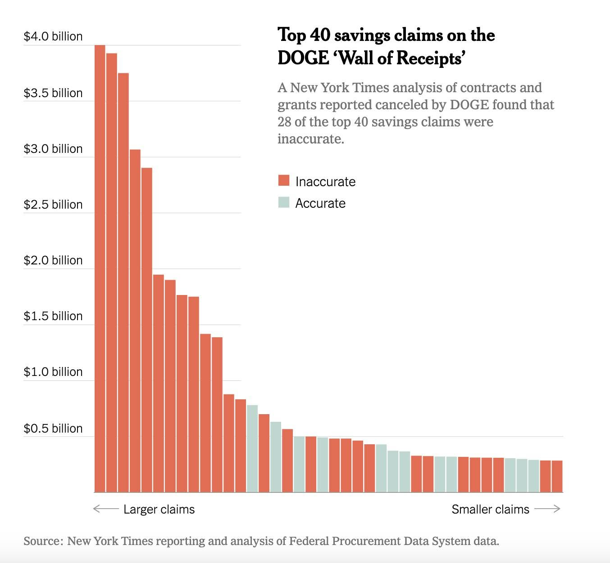

> All of this material is also available on [Google Docs](https://docs.google.com/document/d/16n17djw0xWkJuWYFPE4HWzxqRRD2DIb6jSvhtVjfsLo/edit?usp=sharing) (*MSU login required*)

*Source: <https://www.nytimes.com/2025/12/23/us/politics/doge-musk-trump-analysis.html>*

## The Average Is a Decision

Ask a generative AI system almost anything and you get the consensus. You will get the middle of everything it was trained on. Usually it's reasonable and often it's somewhat useful. But, that is precisely the problem.

A wrong answer invites you to check the work while a reasonable answer does not. Nothing about a fluent, sensible, well-organized response prompts you to go looking for what it left out, and so that few will. Then someone acts on it.

Between 2013 and 2015, [Michigan ran an automated system](https://www.theguardian.com/us-news/2016/feb/12/michigan-unemployment-insurance-benefit-automated-system-fraud-penalties) that decided who had committed unemployment fraud. *Michigan Data Automated System (Midas) was a [rule-based system](https://en.wikipedia.org/wiki/Rule-based_system). Generative AI would not arrive for public use until 2022.* 

Midas garnished wages and seized tax refunds without a human reviewing the determination. The state Auditor General later examined 22,000 of those determinations and found **93% of them involved no fraud**. Roughly 40,000 Michiganders were accused. Some people filed for bankruptcy and others lost their homes.

Australia did something similar around the same time, which eventually lead to the [Robodebt scheme](https://en.wikipedia.org/wiki/Robodebt_scheme). Its scheme took a person's annual income, divided it evenly across the year, and treated the result as what they had earned each fortnight. For anyone with steady work, that average is fine. For anyone seasonal, casual, or intermittently employed, it is wrong by construction; some of those people are those supported through Australia's social welfare system. The scheme wrongly recovered more than A$700 million (~500 Million USD)  from nearly 400,000 people.

**The average described nobody in particular, and the harm fell on the people it described least.**

This week we add **Actions**, completing the DTPA framework. On Monday you will make budget cuts (some with GenAI, some by talking to each other) and we will look at what was decided and why. Then you will analyze a case where someone else did the same thing with real authority.

## Prep reading & resources (Complete by Mon, Sep 21)

*You do not individually have to review all materials. We expect that you will spend at least 90 minutes with these materials. Groups can discuss how to ensure all posted materials are reviewed each week.*

### Why "the average" is a mechanism, not a metaphor

* 📖 [Generative AI enhances individual creativity but reduces the collective diversity of novel content](https://www.science.org/doi/10.1126/sciadv.adn5290) (Doshi & Hauser, *Science Advances*, 2024) — the title tells you what was found. Each individual writer gets better, but the group's writing gets more similar. 
* 📖 [Homogenizing effect of large language models on creative diversity](https://www.sciencedirect.com/science/article/pii/S294988212500091X) (*Computers in Human Behavior: Artificial Humans*, 2025) — built on 2,200 **college admissions essays**, which every one of you has written. Human writing increased the collective semantic diversity of a set of essays roughly two to eight times more than GPT-4 writing did. The effect survived prompt changes and parameter changes specifically designed to make the AI more diverse.
    * The term for this is **algorithmic monoculture**: when everyone consults the same source, individual accuracy can go up while the system loses its ability to be corrected because nobody is left holding the minority view. 
    * Connected to this is a lack of **criticality** in single-shot prompts. When you ask a generative AI about a foundational topic like the Declaration of Independence in a single-shot prompt, it usually delivers a beautifully written, highly confident summary. However, it often lacks deep analysis, historical skepticism, and nuance. For example, [why are Native Americans called "merciless Indian savages" in this foundational document?](https://www.npr.org/2021/07/02/1012680822/examining-a-racist-passage-in-the-declaration-of-independence) (NPR, 2021)

### When the average becomes a decision: Robodebt

* 📺 [What is Robodebt](https://www.youtube.com/watch?v=OfsL9GAbl3M) (YouTube, Knights in Shining Llama; 17 min) —  Over three years, close to half a million Australians were pursued for debts they did not owe. Part 1 is enough for our purposes. [Part 2](https://www.youtube.com/watch?v=rgwvt3jD1Uw) if you are interested (YouTube, Knights in Shining Llama; 25 min).
* 🎧 [Robodebt and Australia's 'rotten' public service](https://ausi.anu.edu.au/news/new-democracy-sausage-episode-robodebt-and-australia-s-rotten-public-service) (Democracy Sausage, ANU, 2023; 46 min) — Rick Morton of *The Saturday Paper* on what the Royal Commission hearings exposed. The Commission's finding: a crude and cruel mechanism, neither fair nor legal, linked to at least three known suicides. Total government repayment and compensation reached roughly A$2.4 billion. *Content note: discusses suicide.*

### Michigan's version: MiDAS

* 📖 [Case Over the Michigan UIA's Faulty Automated System Finally Settled](https://stpp.fordschool.umich.edu/sites/stpp/files/2024-08/stpp-midas-explainer.pdf) (Science, Technology & Public Policy, U-M Ford School, 2024) — short and written for non-specialists with numerous citations. Start here.
* 📖 [Broken: The human toll of Michigan's unemployment fraud saga](https://bridgemi.com/michigan-government/broken-human-toll-michigans-unemployment-fraud-saga/) (Bridge Michigan) — Robert Nevins found out he had been flagged for fraud by checking his bank account. Claimants typically had no idea what they were accused of doing, because the notice stated only the overpayment, the penalty, the interest, and the balance due. 
* 📖 [Algorithm Alchemy That Created Lead, Not Gold](https://spectrum.ieee.org/michigans-midas-unemployment-system-algorithm-alchemy-that-created-lead-not-gold) (*IEEE Spectrum*) — contains the number that should give you pause: auto-adjudicated cases had a 93% false fraud rate, while the 22,589 cases involving *some* human review had 44%. A human in the loop cut the error rate in half and the system was still wrong nearly half the time.
* 📖 [Automated Stategraft](https://wlr.law.wisc.edu/automated-stategraft-faulty-programming-and-improper-collections-in-michigans-unemployment-insurance-program/) (*Wisconsin Law Review*) — The state's penalties and interest fund grew from $3 million to more than $69 million within a year of launch, and the state laid off staff in favor of the computerized process. The vendor's position was that the system did what the state asked, and that only when it got big enough in the papers did anyone suggest turning it off.
* 🖱️ [AI Incident Database, Incident 373](https://incidentdatabase.ai/cite/373/) — the same database you used in Week 3. Note that it reports 34,000 people and an 85% error rate where other sources say 40,000 and 93%. Sources sometimes disagree and we need deeper research to understand why. 
* 📖 [Michigan UI False Fraud Determinations](https://www.btah.org/case-study/michigan-unemployment-insurance-false-fraud-determinations.html) (Benefits Tech Advocacy Hub) — the legal timeline appears on one page: the 2017 *Zynda* settlement in which the agency agreed to stop using MiDAS's automated functions without human review, the 2017 legislation reducing penalties, and the $20 million *Bauserman* settlement approved in January 2024.

### The pattern is older than the technology

* 🎧 [Automating Inequality: Algorithms In Public Services Often Fail The Most Vulnerable](https://www.npr.org/transcripts/586387119) (NPR, *All Tech Considered*, 2018; 7 min) — Virginia Eubanks on Indiana, Los Angeles, and Allegheny County. Full transcript on the page. The sentence to sit with, about Indiana's welfare automation: it seems like one of the intentions was to break the relationship between caseworkers and the families they served. Not a side effect of efficiency. A goal of it.
* 📺 [Virginia Eubanks: Automating Inequality](https://www.youtube.com/watch?v=Wzssyn0L5I8) (2018; 79 min) — the longer version, if your group wants it.

### Happening now: the NSF terminations

*This case is actively disputed both the legality and the rationale are being argued in public and in court. Please read it as a live concern, not a settled account.*

* 📖 [NSF Releases List of Terminated Grants](https://cossa.org/nsf-releases-list-of-terminated-grants/) (COSSA, 2025) — As of May 21, 2025, NSF posted 1,752 terminated grants totaling $1.4 billion, with the STEM Education Directorate accounting for 839 of them and $888 million — 48% of the terminations and 65% of the dollars.
* 📖 [NSF cancels over 400 grants covering disinformation, deepfakes and STEM education](https://www.nextgov.com/policy/2025/04/nsf-cancels-over-400-grants-covering-disinformation-deepfakes-and-stem-education/404731/) (Nextgov/FCW, 2025) —  Normally a program officer evaluates a grant and a separate review must find evidence of non-compliance before termination, with an appeal available to the awardee. Staff said awards were terminated with no visibility to the public or to the officers managing them. DOGE stated it supported cancelling 402 "wasteful grants" for $233 million in savings, and that future awards would prioritize merit, competition, equal opportunity and excellence.
* 📖 [OSU researcher: $700K grant canceled when DOGE misunderstood use of 'climate'](https://www.yahoo.com/news/osu-researcher-700k-grant-canceled-140000260.html) — **Please read this one.** Julie Aldridge lost a $713,155 four-year award titled *The Organizational Climate Challenge: Promoting the retention of students from underrepresented groups in doctoral engineering programs.
* 📖 [Education research takes another hit](https://hechingerreport.org/proof-points-nsf-ed-research-pummeled/) (Hechinger Report) — no official list was released, so an informal group of NSF employees assembled one themselves, which was then posted to Grant Watch. Note what that means: the public record of what was cut exists because people made it by hand.

## Monday: Making Decisions from Generated Output

You will be handed a scenario with a budget you cannot meet and six programs—two of which must be cut. 

1. **Phase 1: Human Discussion Cut (Baseline).** No AI allowed yet. Argue it out with your group using only the provided table, write your 3–5 sentence rationale, and note what missing information would change your mind.
2. **Phase 2: GenAI Baseline Cut.** Feed your scenario table to at least two GenAI tools (e.g., ChatGPT, Gemini, Claude). Paste their verbatim choices and rationales into your group's tab in the [Class Decision Google Doc](https://docs.google.com/document/d/1IpH2nVsvi340zFvx0x06WIiPIjYcYruoGCVXm_MeIic/edit?usp=sharing) (MSU login required).
3. **Phase 3: GenAI Context Probe.** Run a follow-up prompt asking the AI to identify critical hidden legal, financial, denominator, or systemic factors the table might be ignoring. Paste the verbatim response into your doc tab.

On Wednesday, we will reveal the hidden real-world constraints behind each scenario to evaluate whether human discussion or AI context probing successfully caught what was missing.

## Focus for Week 4

This week we add **Actions** and **Critical Lteracy**, which completes the framework. Your Case Study can now include all four sections — Data, Tools, Practices, and Actions — but your evaluation focuses on Actions and Critical Lteracy. 

You may choose your own case, as in Week 3. MiDAS, Robodebt, the NSF terminations, Indiana's welfare automation, and Allegheny County's screening tool are all available, as is anything you find. The requirement is that **the system did something**: issued a determination, seized money, terminated an award, denied a service. A system that only advises is a Practices case. Actions is about how systems (including the humans using AI) act.

### What "meeting the standard" looks like this week

The habit is unchanged since Week 1: a specific claim with a source. For Actions, specific means naming a **decision, a consequence, and a person who could have stopped it.**

* **Stated goal versus outcome.** What was the system for, did it do that, and who was positioned to notice the difference? Include what it achieved, not just what it broke — MiDAS did collect money, and quickly.
    * Weak: *"The system didn't work and hurt people."*
* **Who benefited, who paid, and who decided.** Name all three groups and say whether they overlap. The interesting cases are the ones where the decider bore none of the cost.
    * Weak: *"The government benefited and citizens were harmed."*
* **What the output incentivized.** Not what the system could do — what its *existence* made easy, profitable, or safe to do, and what it made costly to refuse. Once a list of flagged names exists, not acting on it looks like negligence.
    * Weak: *"There was pressure to find fraud."*
* **The remedy, and what it would not have caught.** Name what actually changed, then state its limit. This is the hardest prompt and the one that separates analysis from summary.
    * Weak: *"They added human oversight, which fixed the problem."*

### The trap to avoid

**"Add a human in the loop" is not an answer by itself.** Michigan's auto-adjudicated cases were wrong 93% of the time; cases with human involvement were wrong 44% of the time. The human review halved the error rate and left a system that was still wrong nearly half the time.

So when you name a remedy, say what it would have caught **and what it would have missed**. A reviewer who sees the same screen with the same missing column makes the same mistake more slowly.

*If your Actions section only describes harm, you have written an argument. Actions is an analysis: what the system did, what it was rewarded for doing, and what would have had to be different.*

### Working through the materials

Divide the materials and bring back what you found. Four threads:

1. Why consensus output is a structural property, not a flaw (Doshi & Hauser, homogenization study)
2. Averaging as an actual decision procedure (Robodebt)
3. The local case in full (MiDAS)
4. The same pattern before and after (Eubanks, NSF)

Thread 1 is the one nobody should skip. Without it, Monday looks like a trick played on you rather than a demonstration of something you can now name.

Two content notes: the Robodebt podcast discusses suicide, and the Royal Commission's findings on that are part of the record. The SBS docudrama covers the same ground visually. Either the Eubanks audio or the MiDAS readings will get you the same analytical material if you'd rather not.

Where your group disagrees, write it down. The NSF material is designed to produce disagreement, and you should expect your sources to conflict on the facts as well as the interpretation.

## Citations

Cite all sources in **APA format** in the Research Resources section. Every factual claim in all four sections should be traceable to something on that list.

## Turning In

When you have completed your Case Study, download the Word or PDF version of your tab and turn it in on D2L to the assignment **Week 4 Case Study**. It is a group assignment, so only one member of the group needs to turn it in.

Each of you also submits an **Individual Effort & Metacognitive Report** (~250 words) as a separate individual upload on D2L. Describe what you contributed, what you learned, and any AI used in your work.

**Week 4's Case Study and Individual Reports are due by Sunday, September 27th at 11:59pm.**

## Reminders

Put your group's names at the top of the page, and do not copy from or to other groups' Case Studies.

Case Studies that do not meet the standard will be returned without credit, and your group will have one week from receiving it to revise and meet the standard.

---
