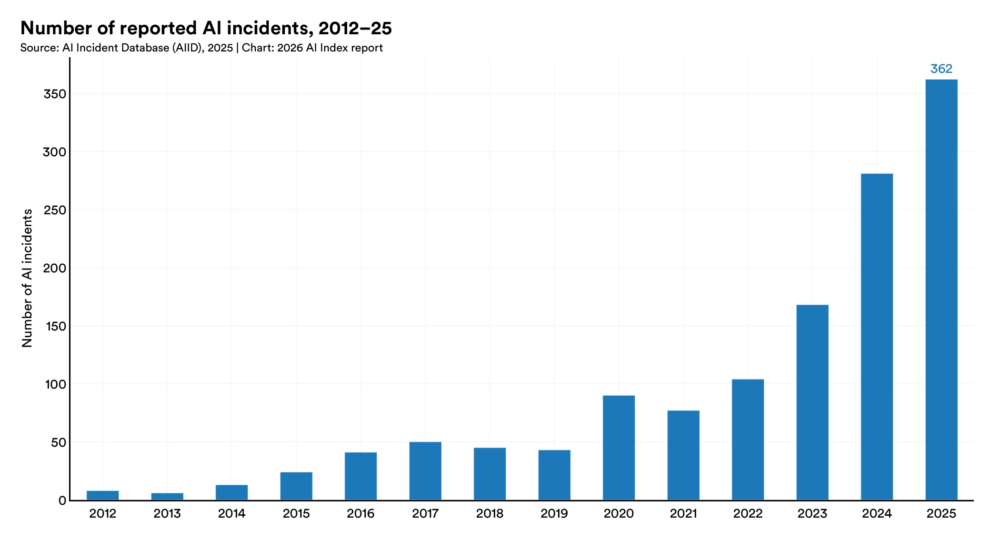

> All of this material is also available on [Google Docs](https://docs.google.com/document/d/1EPpCv-pY1KXrHg8Qe1CzGmJyv2dL1JBEuoBvBvXdNOg/edit?tab=t.0) (*MSU login required*)

*Source: AI Incident Database, via [Stanford HAI 2026 AI Index Report](https://hai.stanford.edu/ai-index/2026-ai-index-report), Chapter 3: Responsible AI*

## From Frameworks to Your Own Case

For the past four weeks we built the DTPA framework one piece at a time: **Data** (Week 1), **Tools** (Week 2), **Practices** (Week 3), and **Actions** (Week 4). Each week, we posted lots of materials and often worked through the conceptual elements of what we were trying to understand. Starting now, you use all four at once, and **you will find the case.**

Full Case I runs across **two weeks**. Your group picks one broad domain and then settles on **one specific, documented case** inside it: a named tool, deployed by a named organization, used in a specific way. The domains for this round are:

* **Healthcare**
* **Art & Creative Industries**
* **Education**
* **Athletics & Sports**
* **Politics & Government**

**You will be given several reports/cases/information available about the topical areas to review.** These materials are here to orient you to what is happening in each domain and to get you asking good questions. They are **not** a menu of pre-picked cases. Your group's case can (and probably should) be something you found yourselves. Finding it is part of the assignment. 

**See the [Two Week Case Analyses Explainer](../assignments/two-week-cases) for the full description.**

_We will be following this approach for Weeks 5-10 (three total cases)._

## How These Two Weeks Cases Will Work

Two things are happening in parallel.

**1. Individually, you are building breadth.** Each week, you will be asked to review material from one topical area, summarize it, and ask preliminary questions you would need to answer from the DTPA perspective. *The following week (e.g., Week 6) you would then choose a different topical area in order to develop a wider breadth of knowledge.* These summaries and preliminary questions are posted as your weekly [Forum Post](../assignments/forum-posts) along with the usual 250-word length and APA formatting expectations.

**2. As a group, you are going deep on one case.** Your group chooses one domain, narrows to one case, and completes a full DTPA analysis over the two weeks.

The domain you review individually does not have to be the domain your group chooses for its case. Reading outside your group's domain is the point of the individual review.

| Week | Individually | As a group |
|:----:|--------------|------------|
| 5 | Review one domain below; summarize; write preliminary DTPA questions | Pick a domain, narrow to a case, find sources → **Update** (Sun Oct 4) |
| 6 | Review a *different* domain below; summarize; write preliminary DTPA questions | Complete the full DTPA analysis → **Full Case** (Sun Oct 11) |

## Prep reading & resources

*You do not individually have to review all materials. You only need to review **one domain per week**. We expect that you will spend at least 90 minutes with the materials in your chosen domain. Groups can discuss how to spread members across domains so that, together, you have seen as much as possible.*

### 🏥 Healthcare

AI in healthcare ranges from tools that write the doctor's notes to tools that decide whether an insurer pays for your care. The same hospital system may use both. Who checks the output? Is a patient informed that a model was involved?

<!-- Instructor key (not shown to students): + promising, − problematic, ± mixed -->

#### Clinical documentation and "ambient scribe" systems

* 📖 [Ambient Artificial Intelligence Scribes to Alleviate the Burden of Clinical Documentation](https://divisionofresearch.kaiserpermanente.org/publications/ambient-artificial-intelligence-scribes-to-alleviate-the-burden-of-clinical-documentation/) (Tierney et al., *NEJM Catalyst*, 2024) — the Permanente Medical Group's own account of turning on an AI scribe for 10,000 physicians in October 2023. Within 10 weeks, 3,442 physicians had used it in about 300,000 patient visits. <!-- + -->
* 📖 [16K hours saved: Ambient AI scribes at Kaiser Permanente](https://www.beckershospitalreview.com/healthcare-information-technology/ai/16k-hours-saved-ambient-ai-scribes-at-kaiser-permanente/) (*Becker's Hospital Review*, 2025) — the follow-up. 7,260 physicians used the scribe in about 2.5 million encounters over 15 months, saving nearly 16,000 hours of documentation. <!-- + -->
* 📖 [Researchers say an AI-powered transcription tool used in hospitals invents things no one ever said](https://fortune.com/2024/10/26/openai-transcription-tool-whisper-hallucination-rate-ai-tools-hospitals-patients-doctors) (Associated Press via *Fortune*, 2024) — the same kind of tool with a different failure profile. OpenAI's Whisper sometimes fabricates whole sentences, and a Whisper-based medical tool from Nabla had transcribed an estimated 7 million visits. <!-- − -->

#### Insurance claims and prior-authorization algorithms

* 📖 [STAT's "Denied by AI" series a model of solid investigative journalism](https://healthjournalism.org/blog/2024/10/stats-denied-by-ai-series-a-model-of-solid-investigative-journalism/) (Association of Health Care Journalists, 2024) — a guide to STAT's four-part investigation, recognized by the Pulitzer committee, into UnitedHealth's use of the nH Predict algorithm to cut off rehab coverage for Medicare Advantage patients. <!-- − -->
* 📖 [UnitedHealth sued over use of algorithm to deny care for MA members](https://www.healthcaredive.com/news/unitedhealth-algorithm-lawsuit-care-denials/699834/) (*Healthcare Dive*, 2023) — the class-action lawsuit that followed. It alleges more than 90% of appealed nH Predict denials were overturned. <!-- − -->
* 📖 [New CMS WISeR Model Revives Concerns of Prior Authorization and Artificial Intelligence](https://medicare.chir.georgetown.edu/new-cms-wiser-model-revives-concerns-of-prior-authorization-and-artificial-intelligence/) (Georgetown Center on Health Insurance Reforms, 2025) — **happening now.** Since January 2026, traditional Medicare in six states, including neighboring Ohio, has used AI-assisted prior authorization for selected services, run by private technology companies through 2031. <!-- ± -->

#### Diagnostic tools and mental-health chatbots

* 📖 [Popular sepsis prediction tool less accurate than claimed](https://ihpi.umich.edu/news/popular-sepsis-prediction-tool-less-accurate-claimed) (University of Michigan Institute for Healthcare Policy and Innovation, 2021) — **a Michigan case.** U-M researchers tested Epic's sepsis model, used in hundreds of hospitals, on nearly 40,000 Michigan Medicine hospitalizations. It missed about two-thirds of sepsis cases while alerting on 18% of all patients. <!-- − -->
* 📖 [AI support in breast cancer screening: fewer missed cancer cases](https://www.lunduniversity.lu.se/article/ai-support-breast-cancer-screening-fewer-missed-cancer-cases) (Lund University, 2026) — the MASAI trial randomized about 106,000 Swedish women to AI-supported mammography or standard reading by two radiologists. AI support found 29% more cancers and led to fewer cancers being missed between screenings. <!-- + -->
* 📖 [First Therapy Chatbot Trial Yields Mental Health Benefits](https://home.dartmouth.edu/news/2025/03/first-therapy-chatbot-trial-yields-mental-health-benefits) (Dartmouth, 2025) — the first randomized trial of a generative AI therapy chatbot. Participants with depression reported a 51% average reduction in symptoms. <!-- + -->
* 📖 [Eating disorder helpline shuts down AI chatbot that gave bad advice](https://cbsnews.com/news/eating-disorder-helpline-chatbot-disabled) (CBS News, 2023) — the National Eating Disorders Association replaced its human-run helpline with a chatbot called Tessa, shortly after helpline workers voted to unionize. Tessa then advised users to aim for calorie deficits of up to 1,000 calories a day. *Content note: discusses eating disorders.* <!-- − -->
* 📖 [Dissecting racial bias in an algorithm used to manage the health of populations](https://chmi.berkeley.edu/news/dissecting-racial-bias-in-an-algorithm-used-to-manage-the-health-of-populations) (Obermeyer et al., *Science*, 2019, summary via UC Berkeley) — a widely used algorithm predicted health *costs* as a stand-in for health *needs*. Because less is spent on Black patients who are equally sick, it concluded they were healthier. Fixing the bias would raise the share of Black patients flagged for extra care from 17.7% to 46.5%. 

---

### 🎨 Art & Creative Industries

Generative AI in the arts raises two different questions that often get blurred together: (1) what the tools were trained on (whose work, with or without permission) and (2) what they are used to make (and who gets credit or pay). 

#### Synthetic performers

* 📖 [SAG-AFTRA actors union fumes over AI 'actress' Tilly Norwood](https://www.upi.com/Top_News/US/2025/09/30/cb-us/8851759277257/) (UPI, 2025) — an AI studio announced a synthetic "actress" and said talent agents were interested in representing her. The actors' union responded that she was built from the work of countless performers without permission or pay. <!-- − -->

#### Music generation and voice cloning

* 📖 [The Beatles Make History With First of Its Kind Win at 2025 Grammys](https://loudwire.com/beatles-history-first-of-its-kind-win-2025-grammys/) (Loudwire, 2025) — machine learning developed by Peter Jackson's team separated John Lennon's voice from a noisy late-1970s demo so the surviving Beatles could finish the song. It won a Grammy at the February 2025 ceremony. <!-- + -->
* 📖 [With help from AI, Randy Travis got his voice back. Here's how his first song post-stroke came to be](https://www.clickondetroit.com/entertainment/2024/05/06/with-help-from-ai-randy-travis-got-his-voice-back-heres-how-his-first-song-post-stroke-came-to-be/) (Associated Press via WDIV Detroit, 2024) — a 2013 stroke left Randy Travis with aphasia. His label built an AI voice model from 42 vocal recordings spanning 1985 to 2013, and another singer provided the demo vocal. <!-- + -->
* 📖 [Universal Music Group settles with AI music startup Udio](https://www.latimes.com/entertainment-arts/business/story/2025-10-30/umg-settles-with-udio) (*Los Angeles Times*, 2025) — the major labels sued the AI song generators Suno and Udio in 2024 for training on their recordings. On October 29, 2025, Universal settled and signed a licensing deal. <!-- ± -->
* 📖 [Warner Music Moves From Litigation to Licensing With Udio](https://decrypt.co/349360/warner-music-moves-from-litigation-to-licensing-with-udio) (Decrypt, 2025) — Warner followed, promising that artists who opt in will receive credit and payment on a new platform launching in 2026. <!-- ± -->

#### Authorship, credit, and film production

* 📖 ['The Brutalist' sparks controversy after film's editor reveals use of AI](https://www.nbcnews.com/pop-culture/movies/-brutalist-sparks-controversy-films-editor-reveals-use-ai-rcna188457) (NBC News, 2025) — the Golden Globe winner for best drama used voice-conversion software to refine its lead actors' Hungarian pronunciation. <!-- ± -->
* 📖 [Supreme Court Denies Cert in AI Authorship Case](https://www.mayerbrown.com/en/insights/publications/2026/03/supreme-court-denies-review-in-ai-authorship-case) (Mayer Brown, 2026) — on March 2, 2026, the Supreme Court declined to hear *Thaler v. Perlmutter*, leaving in place the rule that a work made entirely by AI cannot be copyrighted. <!-- ± -->
* 📖 [The Glaze Project](https://nightshade.cs.uchicago.edu/aboutus.html) (University of Chicago, n.d.) — computer scientists built free tools that alter artists' images so AI models trained on them learn the wrong style (Glaze) or the wrong content (Nightshade). The team reports more than 8.5 million Glaze downloads since 2023.

---

### 🎓 Education

Education is likely where you have the most first-hand experience with AI. Some of the strongest evidence in this domain comes from randomized trials; some of the worst examples are where AI is used without critical evaluation.

#### AI detection used against students

* 📖 [Guidance on AI Detection and Why We're Disabling Turnitin's AI Detector](https://www.vanderbilt.edu/brightspace/2023/08/16/guidance-on-ai-detection-and-why-were-disabling-turnitins-ai-detector/) (Vanderbilt University, 2023) — a university explains, with numbers, why it turned a tool off. Turnitin claimed a 1% false positive rate; Vanderbilt submitted 75,000 papers the year before, so about 750 students could have been wrongly flagged. <!-- constraint -->
* 📖 [University Using AI to Falsely Accuse Students of Cheating With AI](https://futurism.com/artificial-intelligence/students-falsely-accused-cheating-with-ai) (*Futurism*, 2025, reporting on an ABC Australia investigation) — Australian Catholic University logged nearly 6,000 misconduct cases in 2024, about 90% involving alleged AI use, often relying on Turnitin's detector. One nursing student's transcript read "results withheld" for six months while she applied for jobs. <!-- − -->

#### AI tutoring

* 📖 [From chalkboards to chatbots: Transforming learning in Nigeria, one prompt at a time](https://blogs.worldbank.org/en/education/From-chalkboards-to-chatbots-Transforming-learning-in-Nigeria) (World Bank, 2025) — a six-week after-school program in Edo State, Nigeria, where students worked in pairs with GPT-4 under teacher guidance. A randomized evaluation found large gains in English, and participants also did better on end-of-year exams.  <!-- + -->
* 🖱️ [Incident 793: AllHere's Chatbot 'Ed' Fails and Costs Los Angeles Unified School District $6 Million](https://incidentdatabase.ai/cite/793/) (AI Incident Database, 2024) — the second-largest U.S. school district hired a startup to build a student chatbot. The company collapsed within months and its founder was later charged with defrauding investors. <!-- − -->
* 📖 [Generative AI Without Guardrails Can Harm Learning](https://papers.ssrn.com/abstract=4895486) (Bastani et al., *PNAS*, 2025) — a randomized trial with nearly 1,000 high school math students in Turkey. Students with plain ChatGPT access did much better on practice problems, then did 17% *worse* than the control group once access was taken away. A version that gave hints instead of answers mostly avoided the harm.

#### Admissions, enrollment, and grading

* 📖 [Using AI Chatbots to Freeze 'Summer Melt' in Higher Ed](https://campustechnology.com/articles/2017/03/07/using-ai-chatbots-to-freeze-summer-melt-in-higher-ed.aspx) (*Campus Technology*, 2017) — Georgia State ran a randomized trial of Pounce, a texting chatbot that answered admitted students' questions about financial aid and paperwork. "Summer melt," admitted students who never enroll, dropped by about 21%. <!-- + -->
* 📖 [UK govt reboots A Level exam results after computer-driven fiasco](https://www.theregister.com/2020/08/17/uk_exam_results/) (*The Register*, 2020) — when COVID cancelled exams, England's regulator assigned A-level grades with an algorithm partly based on each school's past results. Nearly 40% of teacher-assessed grades were lowered, and state-school students were hit harder than private-school students. Students protested and the government reversed course within days. <!-- − -->

---

### 🏟️ Athletics & Sports

Sports is full of AI that makes decisions in public, sometimes with the whole stadium watching: line calls, strike zones, injury risk. That makes it unusually easy to see the failure profile. It is also full of data about athletes' bodies, which is much harder to see.

#### Officiating and replay systems

* 📖 [Wimbledon says a call on a shot that landed out was missed because the electronic system was off](https://www.foxsports.com/articles/tennis/wimbledon-says-a-call-on-a-shot-that-landed-out-was-missed-because-the-electronic-system-was-off) (Associated Press via FOX Sports, 2025) — in 2025 Wimbledon replaced line judges with electronic line calling for the first time in 147 years and scrapped the old replay review. When the system was accidentally switched off during a match, a clearly out ball went uncalled, with no human backup. <!-- ± -->
* 📖 [Wimbledon changes line-calling system after embarrassing blunder](https://www.enca.com/sport/wimbledon-changes-line-calling-system-after-embarrassing-blunder) (eNCA, 2025) — Wimbledon blamed human error and removed operators' ability to manually switch off ball tracking. <!-- ± -->
* 📖 [Robot umpires coming to MLB in 2026 under new challenge system](https://www.fox5dc.com/sports/mlb-robot-umpires-automated-ball-strike-system-2026) (FOX 5 DC, 2025) — the automated strike zone is a flat plane at the middle of the plate, set at fixed percentages of each batter's height. The rulebook zone is a three-dimensional cube, and human umpires already call about 94% of pitches correctly. 
* 📖 [MLB approves robot umpires for 2026 as part of challenge system](https://www.espn.com/mlb/story/_/id/46357017/mlb-approves-robot-umpires-2026-part-challenge-system) (ESPN, 2025) — a different design choice. MLB kept human umpires and gave teams a limited number of challenges, settled by a 12-camera tracking system. Teams won 52.2% of challenges in spring training tests. <!-- + -->
* 📖 [A comprehensive dive into what we've learned so far from ABS challenges](https://www.mlb.com/news/abs-challenge-system-results-what-we-have-learned) (MLB, 2026) — the first real results with lots of statistics on challenges, when they occur, and who wins them. <!-- + -->

#### Performance tracking, biometrics, and injury prediction

* 📖 [NFL uses AI to predict injuries, aiming to keep players healthier](https://www.foxsports.com/articles/nfl/nfl-uses-ai-to-predict-injuries-aiming-to-keep-players-healthier) (Associated Press via FOX Sports, 2025) — the NFL's "Digital Athlete," built with Amazon Web Services, combines sensor and video data from all 32 teams and generates about 500 million data points a week. The league used it to simulate 10,000 seasons before changing the kickoff rule. <!-- + -->
* 🎧 [NFL's Digital Athlete – How Data is Transforming Player Health & Safety](https://scienceforsport.fireside.fm/286) (*Science for Sport* podcast, 2025) — the NFL's vice president of player health and safety and AWS's global head of sports explain how the system works and how it shaped rule changes. (26 min). <!-- + -->
* 📖 [NCAA Athletes' Right to Privacy in the Digital Age](https://www.theregreview.org/2025/08/12/taylor-ncaa-athletes-right-to-privacy-in-the-digital-age/) (*The Regulatory Review*, 2025) — about 80% of college athletes report their team tracks biometric data such as sleep and heart rate, sometimes around the clock. <!-- − -->
* 📖 [No Pain, No Privacy: Athletic Wearables and the Limits of Consent](https://deeptech.duke.edu/blog-post/no-pain-no-privacy-athletic-wearables-and-limits-consent/) (Curd & Buchanan, *Duke Deep Tech Blog*, 2026) — a blog post on college athletes' biometric data and their rights to privacy. <!-- − -->

#### Fan engagement and athlete protection

* 📖 [Soccer-FIFA detects 7 million abusive comments aimed at players and staff during World Cup](https://www.reuters.com/sports/soccer/fifa-detects-7-million-abusive-comments-aimed-players-staff-during-world-cup-2026-07-18/) (*Reuters*, 2026) — **this summer.** FIFA's AI moderation service flagged more than 7 million potentially abusive posts aimed at players, coaches, and officials during the 2026 World Cup, and staff reported more than 1,000 threats to law enforcement. <!-- + -->
* 📖 [Peacock Unveils Personalized Olympic Recaps Featuring the Voice of Legendary Sports Announcer Al Michaels Generated with A.I.](https://www.nbcsports.com/pressbox/press-releases/peacock-unveils-personalized-olympic-recaps-featuring-the-voice-of-legendary-sports-announcer-al-michaels-generated-with-a-i) (NBC Sports, 2024) — for the Paris Olympics, NBC used an AI clone of Al Michaels's voice, with his agreement, to narrate personalized daily highlight reels, with nearly 7 million versions expected. Editors reviewed each one before release. <!-- ± -->

*We looked for a well-documented case in scouting and recruiting analytics and didn't find one with enough public detail to recommend. If your group finds one, that's a strong case.*

---

### 🏛️ Politics & Government

Government uses of AI touch everyone, including people who never chose to use them. Cases here range from a single fake phone call to citywide planning. This is distinct from Law & Criminal Justice (Full Case II). MiDAS and Robodebt from Week 4 belong here too.

#### Elections and political deepfakes

* 📖 [DeSantis campaign shares apparent AI-generated fake images of Trump and Fauci](https://www.npr.org/2023/06/08/1181097435/desantis-campaign-shares-apparent-ai-generated-fake-images-of-trump-and-fauci) (NPR, 2023) — during the 2024 Republican primary, Ron DeSantis's rapid-response team posted a video attacking Donald Trump's relationship with Anthony Fauci. A collage in the video mixed three real photos of the two men with three apparently AI-generated images of them embracing. Republican senators, including J.D. Vance, objected. <!-- − -->
* 📖 [Political operative who admitted to creating fake Biden robocalls found not guilty](https://www.nepm.org/2025-06-13/political-operative-fake-biden-robocalls-nh-primary-found-not-guilty) (New England Public Media, 2025) — days before the 2024 New Hampshire primary, thousands of voters received a robocall using an AI-generated imitation of President Biden's voice, urging them to skip the primary. It was made by a consultant who had worked for Biden's Democratic primary challenger Dean Phillips; the Phillips campaign denied involvement. The consultant admitted creating the calls and was acquitted on all criminal charges by a jury. <!-- − -->
* 📖 [FCC hits operative behind New Hampshire robocall with $6 million fine](https://cyberscoop.com/fcc-fine-joe-biden-deepfake-new-hampshire-robocall-steve-kramer/) (CyberScoop, 2024) — how the fine was calculated: $1,000 for each of about 3,000 spoofed calls, doubled for egregiousness. <!-- constraint -->

#### Listening to residents at scale

* 📖 [A small US city is experimenting with AI to find out what residents want](https://www.technologyreview.com/2025/04/15/1115125/a-small-us-city-experiments-with-ai-to-find-out-what-residents-want/) (*MIT Technology Review*, 2025) — Bowling Green, Kentucky, expects to nearly double in size by 2050. Local leaders ran a month-long online conversation in which about 8,000 residents proposed and voted on ideas, and a Google tool sorted the responses into themes. <!-- + -->
* 📺 [How a county is using AI to help people find common ground](https://www.pbs.org/video/america-at-a-crossroads-1754516739) (*PBS NewsHour*, 2025) — Judy Woodruff visits Bowling Green and talks with residents who took part, including some who had stopped going to planning meetings (9 min). <!-- + -->

#### Generative AI inside government

* 📖 [Shapiro Administration's Generative AI Pilot for State Workers Leads to Significant Time Savings and Increased Productivity](https://www.pa.gov/agencies/oa/newsroom/icymi--shapiro-administration-s-generative-ai-pilot-for-state-wo.html) (Commonwealth of Pennsylvania, 2025) — 175 state employees across 14 agencies used ChatGPT Enterprise for a year and reported saving about 95 minutes a day. The state employees' union took part. <!-- ± -->
* 📖 [How fake citations appeared in RFK Jr.'s MAHA report: Here are generative AI's red flags in studies](https://api.politifact.com/article/2025/may/30/MAHA-report-AI-fake-citations/) (Tuquero, *PolitiFact*, 2025) — a May 2025 federal health report had at least seven problematic citations, four of them to papers that do not exist, and some links carried a marker left by OpenAI's software. The White House called them formatting issues, and the report was corrected. <!-- − -->
* 📖 [DOGE Developed Error-Prone AI Tool to "Munch" Veterans Affairs Contracts](https://www.propublica.org/article/trump-doge-veterans-affairs-ai-contracts-health-care) (*ProPublica*, 2025) — to meet an executive order requiring review of all VA contracts within 30 days, a DOGE engineer with no health care or government experience built an AI tool in about two days to label contracts "munchable." It read only the first ~2,500 words of each contract and used older OpenAI models, and it misread contract values. <!-- − -->

#### Using AI to Improve Government Services

* 📖 [Inside Amsterdam's high-stakes experiment to create fair welfare AI](https://technologyreview.com/2025/06/11/1118233/amsterdam-fair-welfare-ai-discriminatory-algorithms-failure) (*MIT Technology Review*, Lighthouse Reports & *Trouw*, 2025) — starting in 2021, Amsterdam tried to build a welfare-fraud algorithm the right way: it consulted experts, tested for bias, reweighted the model, and asked welfare recipients for feedback. In a live pilot the system was still biased, and the city scrapped it. 
* 📖 [How a Feel-Good AI Story Went Wrong in Flint](https://www.theatlantic.com/technology/archive/2019/01/how-machine-learning-found-flints-lead-pipes/578692/) (Madrigal, *The Atlantic*, 2019) — **a Michigan case.** After the water crisis, Flint didn't know which homes had lead service lines; the city's records were poor, and each dig cost thousands of dollars. University of Michigan researchers built a model that used home age, value, and location to predict where lead was most likely, and crews' hit rate climbed above 80% by late 2017. Then a contractor took over, largely stopped following the model, and the hit rate fell to about 15%, while the neighborhoods with the most lead got the fewest digs.
* 🎧 [After Flint's Crisis, An Algorithm Helps Citizens Find Lead Pipes](https://www.sciencefriday.com/segments/flint-algorithm-lead-pipes/) (*Science Friday*, 2021) — Ira Flatow talks with U-M's Eric Schwartz, one of the model's builders, and Alexis Smith of Toledo's Freshwater Future about bringing the model to Toledo, where the city estimates 130,000 lead service line connections remain (12 min).

---

### Places to start looking for your own case

The posted materials show you the landscape. To find your case, go further.

| Where | What you'll find |
|---|---|
| [AI Incident Database](https://incidentdatabase.ai/) | Structured, cross-domain, sourced |
| [AI Hallucination Cases Database](https://www.damiencharlotin.com/hallucinations/) | Court decisions involving AI-generated errors |
| [404 Media](https://www.404media.co/) | Ongoing reporting on AI in workplaces, schools, libraries |
| The reports listed above | Each of the reports we have provided can be jumping off points into research that your group can do |

## Your Individual Domain Review

Each week, pick one domain from the list above (a different one in Week 6) and write up the following. These summaries and preliminary questions are posted as your weekly [Forum Post](../assignments/forum-posts) along with the usual 250-word length and APA formatting expectations.

1. **Summary.** What is happening in this domain? Name at least two specific tools, organizations, or deployments from the materials, with a source for each.
2. **Preliminary DTPA questions.** Write at least one question you would need to answer for each part of the framework if you were to analyze a case in this domain:
    * **Data** — What was collected, from whom, and how was it categorized?
    * **Tools** — What does the tool do, and what is its failure profile?
    * **Practices** — Who uses it, whose labor built it, and what pushed back?
    * **Actions** — What does it decide, who benefits, who pays, and who could stop it?
3. **A possible case.** Name one specific, documented case you *could* imagine analyzing. It does not have to be one from the materials.

- A strong question sounds like: *"Who reviews a prior-authorization denial before it reaches the patient, and is that review step written into the insurer's policy?"*
- A weak question sounds like: *"Is AI in healthcare biased?"*

## Class Meetings

| Day | Date | Focus |
|:---:|:----:|-------|
| M | **Sep 28** | Introducing Case Design and Full Case I - Planning and Research |
| W | **Sep 30** | Full Case I - Planning and Research |
| F | **Oct 2** | Full Case I - Planning and Research; Complete Part A of Template |
| M | **Oct 5** | Full Case I — Research and Drafting Case Analysis |
| W | **Oct 7** | Full Case I — Research and Drafting Case Analysis |
| F | **Oct 9** | Full Case I — Completing Case Analysis; Complete Part B of Template · 🎯 **Case Design Plan I due** |

* **Week 5:** You *may* select your groups for Full Case I, and you *must* select your groups for the Case Design.
* **Week 6:** You must continue in your groups for Full Case I.

## Choosing Your Case

**"Domain" is not "case."** *"AI in healthcare"* is not a case; *a specific hospital system's use of a AI-powered documentation tool* is. Narrow down quickly, so you have time left to research and not just to search.

Your case needs:

* A **named tool** (where possible)
* A **named organization** that deployed or used it
* A **documented deployment**, which is something that happened, with a date, reported in a source you can cite. A general trend piece is not enough.

Pick a domain your group actually wants to spend two weeks in. You'll be with it, and with each other, for the full round.

### The trap to avoid

**Do not stop at the first case you find, and do not default to the ones we posted.** The posted materials are the most visible stories in each domain, which is exactly why they are a place to start and not a place to finish. The best cases in this course so far have come from a group following one source to another until they reached something specific that nobody handed them.

## Focus for Weeks 5 and 6

This is the first **full** Case Study. All four sections — Data, Tools, Practices, and Actions — are evaluated. The standard for each is the one you built in Weeks 1–4:

* **Data** — what was collected, by whom, and how it was categorized, cleaned, or encoded; who the categories miss. ([Week 1](../week1/))
* **Tools** — mechanism, provenance, deployment, and failure profile. Accuracy alone tells you almost nothing. ([Week 2](../week2/))
* **Practices** — the workflow, the labor and resources, and constraint versus critique. ([Week 3](../week3/))
* **Actions** — stated goal versus outcome; who benefited, paid, and decided; what the output incentivized; the remedy and its limits. ([Week 4](../week4/))

All four Pillars of AI Literacy will be evaluated as well. These are **Section 3 of your Case Study template**, and they work differently from DTPA: DTPA describes *the case*, while the pillars are lenses you use to *reflect on* it. Each pillar should draw on evidence from across your DTPA sections, not only one.

* **Data Literacy** — Where did the data come from? Who contributed? How does the data reinforce societal biases? ([Week 1](../week1/))
    * Weak: *"The system was trained on biased data."*
* **Ethical Literacy** — Who is protected or targeted? Who is forced to be the system's subject? What ethical trade-offs are inherent in the deployment? ([Week 2](../week2/))
    * Weak: *"The system is unfair to some people."*
* **Quantitative Literacy** — How can you interpret the technical claims? What are the energy, labor, economic, or other costs of training and deployment? ([Week 3](../week3/))
    * Weak: *"The tool is 95% accurate, but AI uses a lot of energy."*
* **Critical Literacy** — How does the system fit into broader AI narratives ("solutionism" vs. "existential threat")? How can you balance skepticism with practical judgment to navigate benefits and risks? ([Week 4](../week4/))
    * Weak: *"AI has benefits and risks, so we should be careful."*

**Record your disagreements.** For each pillar, note where your group disagreed and whether you resolved it. If you couldn't, say so and lay out both positions. An unresolved disagreement, clearly written, is evidence of analysis, not a failure of it.

The habit is unchanged since Week 1: **a specific claim with a source, not a general statement.**

### Week 5 Update (due Sun Oct 4)

The Update is a checkpoint, not a draft of the full case. It exists to catch three problems while there is still a week left to fix them: groups that are stuck on a **domain** instead of a **case**, groups that have **too few sources** (or only one kind of source), and groups that can't yet speak to one or more parts of **DTPA**.

Answer each question below in your group's tab. Short answers are fine; specific answers are required. Your work on the case should be present in the tab (i.e., not complete writing, but your research should be present).

#### 0. Your Notes/Research

Start with **Section 0 (Your Notes/Research)** at the top of Part A. Use it to save links, notes, and planning so no useful work gets lost, then answer Questions 1–8 below.

#### 1. The case

**In one or two sentences, state your case: what tool, used by what organization, to do what, and when.**

Then check it against these four questions. If you can't answer "yes" to all four, you have a domain or a topic, not a case yet.

* Does it name a **specific tool or system**? (If the tool is unnamed in the reporting, say so and describe it as precisely as the sources allow.)
* Does it name a **specific organization** that built, bought, or deployed it?
* Did it **actually happen**, with a date or time frame, rather than being proposed or predicted?
* Could a classmate **look it up** from what you wrote?

A strong answer sounds like: *"In [year], [named organization] began using [named tool] to [specific task], affecting [who]."* A weak answer sounds like: *"We are looking at how AI is being used in college admissions."*

#### 2. How you got there

**What other cases did your group consider, and why did you set them aside?** Name at least two.

This shows us that you narrowed, not that you took the first result. "Not enough sources," "we couldn't find who deployed it," and "it was only a pilot" are all good reasons. Write them down.

#### 3. Sources so far

**List every source you have found so far in APA format.** Aim for at least **four sources that are about your specific case**, not just your domain. Then label each one:

| Source (short citation) | About the case, or background? | Kind of source | What it's good for (D, T, P, A) |
|---|---|---|---|
| | | | |

For **kind of source**, use one of: *reporting* (news, investigative journalism), *official record* (court filing, audit, policy, government report, regulatory filing), *organization's own account* (vendor site, press release, help page), *research* (peer-reviewed or preprint), *advocacy* (a group arguing a position), or *first-hand account* (people affected, workers, users).

Then answer: **What kinds of sources are you missing?** A case built only on news reporting, or only on the company's own description, has a gap. Remember Week 3: OpenAI's help page and 404 Media's tracking device told very different stories about the same practice.

#### 4. DTPA readiness

**For each part of the framework, write one specific claim you can already make (with its source) and one question you still need to answer.** Rate how ready you are.

| | One claim we can make now (with source) | One question we still need to answer | Where we'll look | Ready / Partial / Not yet |
|---|---|---|---|---|
| **Data** | | | | |
| **Tools** | | | | |
| **Practices** | | | | |
| **Actions** | | | | |

A reminder of what each part asks for:

* **Data** — What was collected, from whom, by whom, and how was it categorized or encoded? Who do the categories miss?
* **Tools** — Mechanism, provenance, deployment, failure profile. What is the output *allowed to do*?
* **Practices** — Who uses it and how (the workflow, not the product)? Whose labor and what resources did it take? What critique exists, and did it produce any constraint?
* **Actions** — What did the system *decide or do*? Who benefited, who paid, who decided? What remedy exists, and what would it miss?

#### 5. The thinnest part

**Which part of DTPA is weakest for your case right now, and why?**

Be honest about which of these it is:

* We haven't looked hard enough yet (say where you'll look next), or
* The information isn't public (say who has it and why they might not share it).

The second is a legitimate finding, not a failure. A vendor that won't disclose its training data, or an agency that didn't publish its error rate, is part of your analysis. But you have to show that you looked.

#### 6. Where you disagree

**Where does your group currently disagree** about the case, whether about the facts, about what the sources say, or about how to interpret it? If you don't disagree about anything yet, name the question you expect to disagree about.

#### 7. Plan for Week 6

**Who is doing what before the Full Case is due?** List each group member, the part of the analysis they're responsible for, and the sources or questions they're chasing. Every member should appear.

| Group member | Responsible for | Chasing (sources or questions) |
|---|---|---|
| | | |

#### 8. A question for us

**What is one question you have for the instructional team** about your case, your sources, or the standard?

### Week 6 Full Case (due Sun Oct 11)

The complete Case Study, using the same template and DTPA framework as the weekly analyses.

Where your group disagrees, write the disagreement down.

## Citations

Cite all sources in **APA format** in the Research Resources section. Keep a running bibliography from the first day of Week 5; your Update will already need it. Every factual claim in all four sections should be traceable to something on that list.

## Turning In

**Week 5 — Update.** Download the Word or PDF version of your tab and turn it in on D2L to the assignment **Week 5 Full Case I Update**. It is a group assignment, so only one member of the group needs to turn it in.

**Week 6 — Full Case.** Download the Word or PDF version of your tab and turn it in on D2L to the assignment **Week 6 Full Case I Complete**. Again, one member of the group turns it in.

Each week, each of you also submits an **Individual Effort & Metacognitive Report** (~250 words) as a separate individual upload on D2L. Describe what you contributed, what you learned, and any AI used in your work.

**Due dates:**

* **Sunday, October 4th at 11:59pm**
    * Week 5 Full Case I *Update* (Part A of Template) 
    * Week 5 Individual Effort & Metacognitive Report
* **Friday, October 9th**
    * 🎯 Case Design Plan I
* **Sunday, October 11th at 11:59pm**
    * Week 6 Full Case I *Complete* (Part B of Template)
    * Week 6 Individual Effort & Metacognitive Report 

## Reminders

Put your group's names at the top of the page, and do not copy from or to other groups' Case Studies.

Case Studies that do not meet the standard will be returned without credit, and your group will have one week from receiving it to revise and meet the standard.

---