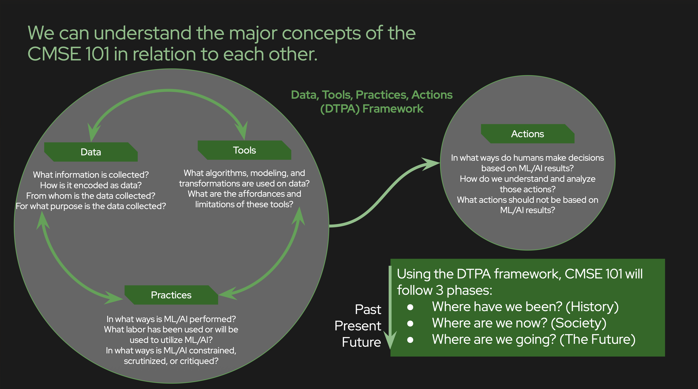

<!-- _class: title -->
# AI in the Real World
## Data, Power, & Society

**CMSE 492 (aka CMSE 101) • Fall 2026**
Prof. Danny Caballero

---

# Welcome! 👋

This is not a coding class.

You will not learn to build AI systems.

**Instead, you will learn to evaluate, question, and push back on them.**

This class aims to help you become a **Critical Pragmatist** when it comes to AI.

---

# Why This CMSE 492 (aka 101)?

By the time you graduate:
- **You will work with AI systems.** Probably with many of them.
- **You will make decisions about AI.** How to use it, when to trust it, whether it should be used at all.
- **Forms of AI will be a part of your everyday life** From websites to software to vehicles to appliances.
- **Others will ask your opinion.** "Does this AI system seem fair to you?" "Should we deploy this?" "Do you trust it?"

**This course prepares you to answer those questions with evidence, not intuition.**

---

# Who are your instructors?

**Prof. Danny Caballero (he/they)** - Physics & Astronomy; CMSE; CREATE for STEM

- Lappan-Phillips Professor of Math and Science Education
- Co-direct two research labs (in Physics & Computational Science Education)
- BS Physics, Texas; MS & PhD Physics, Georgia Tech; Postdoc Physics Education, CU-Boulder
- Former custodian, copy shop manager, high school physics teacher in Atlanta Public Schools
- Labor organizer for the Union of Tenure System Faculty (UTSF-MSU)
- Starting my 14th year at MSU **(Go Green!)**
 
> If you are comfortable, please call me "Danny", but Prof. Caballero is fine, too.

---

# Who are your instructors?
 
**Jorge Martinez-Ortiz** - CMSE & Political Science
 
- 4th year PhD Student in CMSE and Political Science
- BS Physics, Baylor University
- International student from Zacatecas, Mexico
- Treasurer for the Comunidad Latinoamericana (CLA) graduate student org.
 
> You can call me “Joy” or “Jorge”.

---

# A Note on the Material

This course covers topics related to AI that may be:
- **Sensitive** (algorithmic discrimination, bias, surveillance)
- **Controversial** (regulation, job displacement, autonomy)
- **Uncertain** (AI's future role, long-term impacts)

It's also going to touch on issues that affect people differently whether that be **gender**, **race**, **ethnicity**, **class**, **disability**, or **immigration status**.

- We are all affected by AI and more connected to each other than we realize. 
- Each of you has **different biases, experiences, and perspectives.** That includes your instructors.

**We will not all agree. That's completely okay.** But we will listen and hear with humanity.

---

# Our Shared Framework: DTPA

We use **one vocabulary to analyze everything**. 

## The Data-Tools-Practices-Actions Framework

Instead of each person bringing their own lens, we will strive to speak the same language.

This lets us **disagree on conclusions** while **agreeing on facts.**

> **By the end of the course, you'll be fluent in DTPA analysis.** It can be your  *starting* toolkit for evaluating *any* AI system.

---

# The DTPA Framework

---

# The Four Components of DTPA

**DATA**
What information is collected? Who is included/excluded? What gets erased?

**TOOLS**
How does the AI actually work? What assumptions are built in? What can it do? What can't it do?

**PRACTICES**
Who uses this system? How? What labor built it? How is it constrained or enabled?

**ACTIONS**
What happens as a result? Who benefits? Who is harmed? Does it solve the stated problem?

---

# Course Structure

**Three main components grade you:**

1. **Class Engagement (40%)**
2. **Case Studies (30%)**
3. **Case Design (30%)**

Your letter grade will be determined by the following cutoffs:

| Earned Grade | 4.0 | 3.5 | 3.0 | 2.5 | 2.0 | 1.5 | 1.0 | 0.0 |
|--------------|-----|-----|-----|-----|-----|-----|-----|-----|
| Score Range  | > 3.75 | 3.74... - 3.25 | 3.24... - 2.75 | 2.74... - 2.25| 2.24... - 1.75 | 1.74... - 1.25 | 1.24 - 0.75 | < 0.75 |

---

# 1. Class Engagement (40%)

**Each component counts equally towards your grade.**

- **Daily Class Attendance & Participation**
   - Being attendant is important; we will use lots of group work and being present for your group matters; we will check for your participation daily
- **Forum posts (weekly) + replies (~250 words each)**
   - Posts are expected in response to prompts every week; APA formatting required; Forum replies earn "Deeper Engagement" credit
- **Exit tickets (after every class, ~100 words each)**
   - Each class you will debrief before 5pm; this can also be a place to tell me how you are doing with the material or how things went today

---

# 2. Case Studies (30%)

**Each component counts equally towards your grade.**

- **Case Studies (Google Doc Template)**
   - Analyze AI systems using DTPA each week as a group; turn in your weekly report by Sunday 11:59pm
- **Individual & Metacognitive Report (~250 words)**
   - Reflect on your own learning and effort; bring your values into what we just completed; turn in your report by Sunday 11:59pm

---

# 3. Case Design (30%)

**Each component counts equally towards your grade.**

- **Semester-long group project** 
   - Research & design an AI policy or application
- **Two scaffolded assignments (Oct 2nd & Nov 6th)**
   - Support your group's development
   - Receive and respond to feedback from instructors
- **Final showcase (draft due Dec 4th, present last week of class)**
   - Showcase is ungraded but will have class feedback to improve final turn-in
   - Presenting at showcase unlocks final turn-in
- **Final project turn in (Day of our final exam)**

---

# How We Grade: Labor & Standards-Based

This is **not** a traditional grading system.

**What it means:**
- Your grade reflects your effort and growth, not just "right answers"
   - *There are no right answers to what we are working on*
- Most assignments get a second chance if you don't meet the standard initially
- There's no curve, no "grading on a bell curve"; everyone can earn a 4.0

---

# How We Grade: Labor & Standards-Based

This is **not** a traditional grading system.

**What it doesn't mean:**
- "Do whatever you want and pass"
- Standards are real, and we hold to them
- You need to revise and engage with feedback

>The goal: Learn the material deeply, not just perform well on a test.
> **We have no tests anyway!**

---

# What Does "Meeting the Standard" Look Like?

*"In general"* - specifics are available in assignments.

**Meets Standard (3.0)**
- Evidence from reliable sources; documenting sources well
- Thoughtful analysis using the DTPA framework
- Acknowledgment of complexity and multiple perspectives
- Clear and respectful communication

**Exceeds Standard (3.5–4.0)**
- Deep research beyond assigned readings; new resources and perspectives
- Metacognitive reflection on your own learning; deep engagement
- Leadership, Exceeding Efforts, or Novel Contributions in group work

---

# Class Culture & Expectations

**Here's what we need from you:**

- **Show up.** Physically and mentally. Exit tickets require attendance.
- **Engage thoughtfully and respectfully.** Disagreements are ok, arguments are not.
- **Think about your position.** No one has your experience and background. 
- **Disclose AI use.** If you used it tell us. We trust you.
- **Meet deadlines.** Forum posts due before class each week. Most of other is due Sundays 11:59pm.
- **Ask questions.** If something doesn't make sense, say so.

---

# Class Culture & Expectations

**Here's what you should expect from us:**

- Clear expectations and timely feedback
- A second chance on most assignments
- Support if you're struggling; space if you need it
- Respect for your time and perspectives; valuing you as a person
- Stepping in to manage issues, concerns, and disagreements

---

# This Week's Agenda

1. **Course intro** (you're here ✓)
2. **Group the class!** - Get up and move around!
3. **Constructing Categories** - How we perceive people matters.
4. **Wednesday: Who do we make into groups?** – We'll work through the Census timeline together
   - *In your assigned groups*
4. **Wednesday & Friday: First Case - Census Data** – Focusing on the Data in DTPA

**Exit ticket** – Your first one is due by 5pm today on D2L.

---

# Making Groups - Part 1

- Break into six random groups of roughly equal size 
- You have five minutes to come up with as many things you all have in common
   - Nothing pejorative (e.g., *we all hate Drake*) or physics (e.g., *we all have red hair*)
- You will have three more minutes to identify the top 2-3 things you all think the rest of the room **won't** share
   - Each of you write on those 2-3 things on index cards (1 idea per card)

---

# Making Groups - Part 2

- Shuffle into six *new* random groups of roughly equal size 
   - No more than one other person from your first group
- Share your 2-3 things; is there anything that hangs you all together?
   - Again, nothing pejorative (e.g., *we all hate Drake*) or physics (e.g., *we all have red hair*)
   - Decide on top 2-3 (discard unused cards; write new cards)
   If you can't find 2-3 things, shuffle again!
- **Once you 2-3 things with a new group, try to name your group!**

---

# Making Groups - Wrap Up

## Share out the commonalities!

**Discussion**: 
- Are these categories the same "kind of thing"? 
- Are they truly unique? 
- What does it mean to categorize people?

---

# Our Kind of People - Bayeté Ross Smith

**Source:** *https://www.bayeterosssmith.com/our-kind-of-people*

---

# Our Kind of People - Bayeté Ross Smith

- Break into six groups of roughly equal size; we will count off group numbers
- On D2L, open the link to the [Gallery: Our Kind of People](https://docs.google.com/document/d/1a-4tndR8UAYX9rzKS-n1tbL6dGgCY7Q5jofm_Eu-8h0/edit?tab=t.0#heading=h.m1yl8830yw7o) Activity under In Class Materials -> Day 01.
   - Write your names at the top of your Group's Tab in the Google Doc
## Read the instructions and start working (7 mins.)
> Write down a list of labels or assumptions someone might make about the person in the photo, answering the question: What assumptions might someone make (regardless of what this person intended to convey) about this person’s identity?

---

# Reflection Questions (10 min)

- Why did each group have different labels for photos of the same person?
- How do we use labels to understand each other? When might those labels be incorrect or incomplete?
- Where do the labels and stereotypes we apply to others come from?
- How does clothing allow people to emphasize certain parts of their identities? In what ways does it allow people to hide other aspects of who they are?
- These images are part of a larger work by an artist named Bayeté Ross Smith, titled “Our Kind of People.” What message do you think the artist was trying to convey by creating this project?

---

# Reminders for this week

- Don't forget to complete today's Exit Ticket by 5pm (on D2L)
- Review your group assignment on D2L and connect with your group before Wednesday's class!
- Spend time before Friday (~90 minutes) going over this week's preparatory materials

## Questions?

Email Danny (<caball14@msu.edu>) and/or Jorge (<martjor@msu.edu>)

**Have a great first week!**