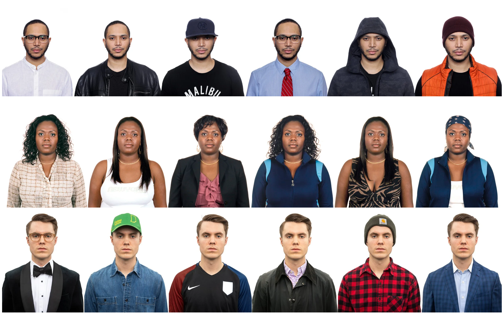
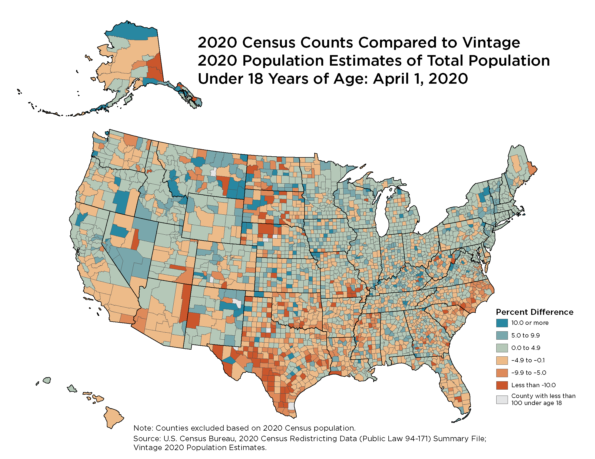
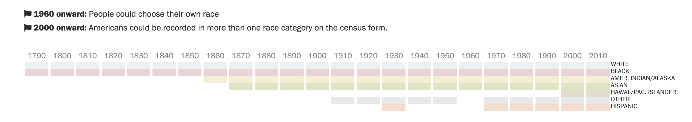

<!-- _class: title -->
# AI in the Real World
## Data, Power, & Society - Day 02

### Foregrounding groups in human data

**CMSE 492 (aka CMSE 101) • Fall 2026**
Prof. Danny Caballero

---

# Answer to Your Questions...so far.

- **Is there an Honors Option?**
   - Yes there will be. Gimme a couple weeks to post some information about it.
- **Does this course count as a "selective"?**
   - Yes, for Data Science majors only. Ask Kevin M. if you have questions/issues.
- **Wait, where do we find our assigned groups?**
   - For the first few weeks, you have been assigned groups. Find them using the D2L group assignment.
- **How long will we have these groups?**
   - About 4-5 weeks depending on how the schedule goes. You will switch to new groups later.
- **What happens if I'm absent during group work?**
   - It is your job to communicate with your group and distribute the work accordingly. 
   - *You cannot complete Case Studies individually; they require discussion.*
- **What about the final project?**
   - You will select your final project groups and tell us Oct. 2nd.
- **Office Hours?**
   - Complete this [office hours poll](https://crab.fit/cmse-492-office-hours-655856) by next Wednesday - also posted in D2L.

---

# This Week's Agenda

1. **Course intro** (✓)
2. **Group the class!** - Get up and move around! (✓)
3. **Wednesday: Constructing Categories** - How we perceive people matters (you're here ✓).
4. **Wednesday: Who do we make into groups?** – We'll work through the Census timeline together
   - *In your assigned groups - find them on D2L*
4. **Friday: First Case - Census Data** – Drawing on Wednesday's work; Focusing on the Data in DTPA

**Exit ticket** – Your second one is due by 5pm today on D2L.
**Case Analyses** - Today, we will get started together; try to complete Friday; due Sunday 11:59pm.

---

# Quick Debrief from Monday's class

**From Exit Tickets:**

- It was challenging at first to find common interests
  - It was nice to meet most of the class on the first day
- We often had to make larger categories as we moved around
   - Some categories got discarded, some new ones were adopted
- We had to dive into the "data" quite a bit to develop categories
   - It still felt like we were making generalizations.

> This activity was meant to illustrate a **social constructivist** approach to making categories.

---

# Activity: Our Kind of People - Bayeté Ross Smith

**Source:** *https://www.bayeterosssmith.com/our-kind-of-people*

---

# Activity: Our Kind of People - Bayeté Ross Smith

## Break into six groups of roughly equal size

- We will count off group numbers (1-6)
- On D2L, open the link to the [Gallery: Our Kind of People](https://docs.google.com/document/d/1a-4tndR8UAYX9rzKS-n1tbL6dGgCY7Q5jofm_Eu-8h0/edit?tab=t.0#heading=h.m1yl8830yw7o) Activity 
   - On D2L, under In Class Materials -> Day 02.
   - Write your names at the top of your Group's Tab in the Google Doc
      - *This is how we count attendance; don't forget!*

## Read the Instructions
> Write down a list of labels or assumptions someone might make about the person in the photo, answering the question: What assumptions might someone make (regardless of what this person intended to convey) about this person’s identity?

## You will have about 10 mins

---

# Activity: Our Kind of People

## Reflection Questions (15 min)

**Feel free to take notes in the [Last Tab of the Google Doc](https://docs.google.com/document/d/1a-4tndR8UAYX9rzKS-n1tbL6dGgCY7Q5jofm_Eu-8h0/edit?tab=t.ln5hiyuplzus)**
*These answers can be helpful to your Case Analyses*

- Why did each group have different labels for photos of the same person?
- How do we use labels to understand each other? When might those labels be incorrect or incomplete?
- Where do the labels and stereotypes we apply to others come from?
- How does clothing allow people to emphasize certain parts of their identities? In what ways does it allow people to hide other aspects of who they are?
- These images are part of a larger work by an artist named Bayeté Ross Smith, titled “Our Kind of People.” What message do you think the artist was trying to convey by creating this project?

---

# Case Study: Data Collection and The US Census

*<https://www.census.gov/newsroom/blogs/random-samplings/2021/11/demographic-benchmarks-2020-census.html>*

---

# We will focus on Data in DTPA

## By first exploring historical categorizations, you will begin to answer:

- **Collection:** What was collected, by what method, and by whom? Was race self-reported or assigned by an enumerator? How did that change over time and why?
- **Criteria:** Who is included and who is excluded by the categories themselves? Name a specific group and a specific census year. Unpack or follow what happened.
- **Manipulation / Encoding:** What happens to a response after it is submitted? Look for editing, imputation, recoding, and back-end processing rules. *You might need to do more research here.*
- **Bias & Inequity:** Give a concrete downstream consequence. Who lost funding, representation, visibility, or safety because of how the data was structured? *You might need to do more research here.*

**In this first case study, your group will aim to complete the Data elements of the [Case Study Template](https://docs.google.com/document/d/1KDA21HfV4pG8gozaLeHzXRhVkrgbP5hliAXatMGOnsU/edit?tab=t.mcr5a041tko3)** (*Google Docs; MSU login required*)

> We will build up to the full template over time.

---

# Activity: The US Census and its history of race/ethnicity

## Races Counted in the US Census over Time

**We will start working together in this set of [Google Slides](https://docs.google.com/presentation/d/1caOIp7pn2KzSW5xzRqcDWmzPkIQLYZkyyn-5dVzDO5g/edit?usp=sharing)**

---

# Activity: The US Census and its history of race/ethnicity

## Tracing racial/ethnic grouping over time

1. In your preparatory materials, we included the Pew research center’s interactive tool on racial data collected on the US census: <https://www.pewresearch.org/interactives/what-census-calls-us/>
2. In this activity you will select a racial category to follow over time
   -  Discuss in your group at least 2 categories to dive into as a group
   - Using events that were happening in the US (see the slides 3 and 4 for examples, and slide 5 for more links), place your census categories on this timeline
   - On your group’s slide, create a representation of this history

**Come with a complete timeline for discussion on Friday**

---

# Friday's Activity: The US Census and its history of race/ethnicity

## Discussion

- **Collection:** What was collected, by what method, and by whom? Was race self-reported or assigned by an enumerator? How did that change over time and why?
- **Criteria:** Who is included and who is excluded by the categories themselves? Name a specific group and a specific census year. Unpack or follow what happened.

**Work on Case Study in Friday's class; complete at home.**

---

# Reminders for this week

## Exit Tickets, Forum Posts, Office Hours

- Don't forget to complete today's Exit Ticket by 5pm (on D2L)
- **Friday:** Free work on Census Case Study
   - Case study due 11:59pm Sunday
   - Individual and Metacognitive Reflection due 11:59pm Sunday
- Spend time before Sunday (~90 minutes) going over next week's preparatory materials
   - Forum Post (Week 2) due 11:59pm Sunday (anonymous to class; Jorge and Danny can see author)
   - If you choose to reply, due 11:59pm Thursday (anonymous to class; Jorge and Danny can see author)
- Complete this [office hours poll](https://crab.fit/cmse-492-office-hours-655856) by next Wednesday - also posted in D2L.
