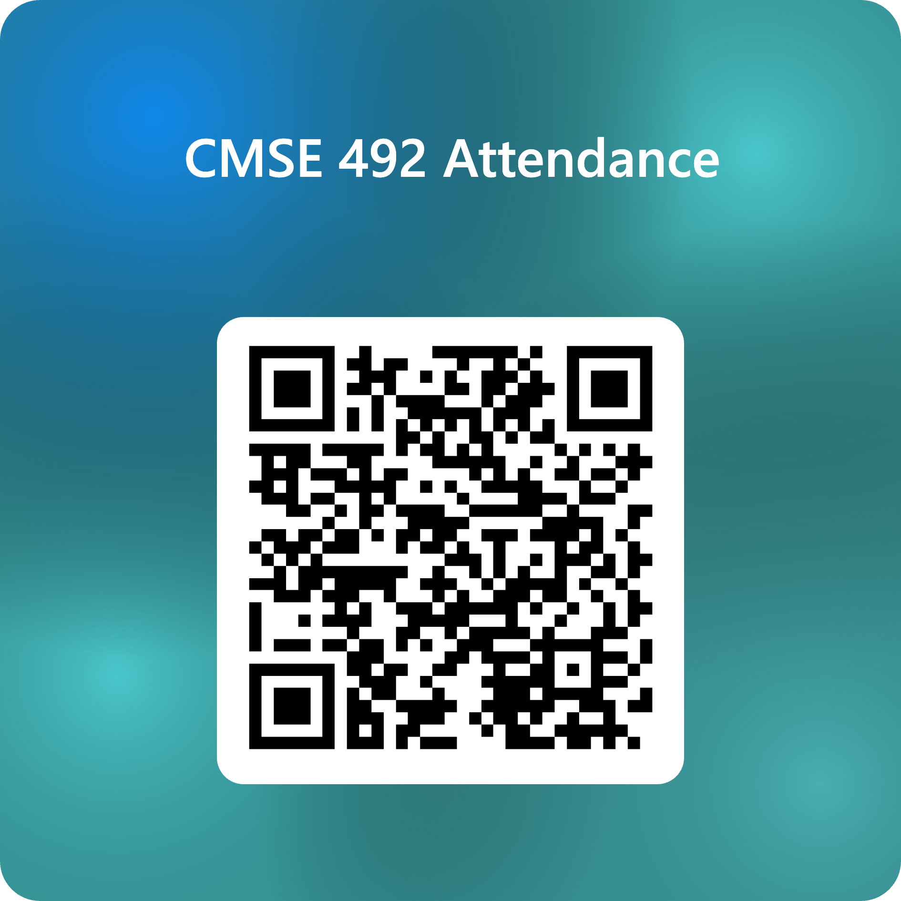

<!-- _class: title -->
# AI in the Real World
## Data, Power, & Society - Day 16

### Full Case I: Continuing Your Case Studies

**CMSE 492 (aka CMSE 101) • Fall 2026**
Prof. Danny Caballero

  
## Today's Six Digits: 529873

---

# Today: Keep Working on Your Case Study

1. **Check in** as a group: where did you land after Monday?
2. **Revisit** the comments in your Google Doc
3. **Work** on **Part B** of the template
4. **Divide up** what remains before Sunday

*We'll be circulating. Ask us anything.*

**Reminder:** Case Design Scaffold I is due Friday!

---

# Exit Ticket Today

- **Today is a Wednesday, so there is an Exit Ticket.**
- Complete it on **D2L** by **11:59pm today**.
- You need to be in class to earn credit.

---

# Reminders

- **Fri, Oct 9:** Case Design Scaffold 1 due - you pick your groups!
- **Sun, Oct 11:** Case Study I (Part B) due
- **Wed, Oct 14:** You will know if Case Study I meets the standard
- **Wed, Oct 21:** Revised Case Study I due (if needed)
